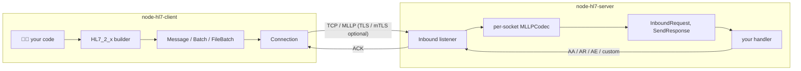

# 🩺 Node HL7 Server and Client

> Monorepo for the **`node-hl7-client`** and **`node-hl7-server`** TypeScript packages — a complete, dependency‑light HL7 v2.x toolchain for Node.js.

`node-hl7` is everything you need to **build**, **send**, **receive**, **acknowledge**, and **parse** HL7 messages on top of the traditional TCP / MLLP transport, with first‑class TLS and mTLS support.

> ⭐ **Coming from the standalone repos?** Both `node-hl7-client` and `node-hl7-server` previously lived in their own repositories and racked up a lot of stars between them — thank you! 🙏 The two packages now live together here as a monorepo, but the original stars don't carry over. **If you've used either package, please drop a ⭐ on this repo so the new home reflects the real community size.** It helps with discoverability and tells contributors the project is alive.

## 📦 Packages

| Package | Version | What it does |
|---|---|---|
| [`node-hl7-client`](./packages/node-hl7-client) | [](https://www.npmjs.com/package/node-hl7-client) | 🩺 Builder, parser, and outbound TCP/MLLP client. |
| [`node-hl7-server`](./packages/node-hl7-server) | [](https://www.npmjs.com/package/node-hl7-server) | 🏥 Inbound listener with auto + custom ACKs, MSH overrides, TLS/mTLS. |

## 🧭 Architecture at a glance



Every TCP connection on the server side gets its **own** `MLLPCodec` instance so concurrent senders never interleave their byte streams.

## 🚀 60‑second example

**Server**:

```ts
import { Server } from "node-hl7-server";

const server = new Server({ bindAddress: "0.0.0.0" });
server.createInbound({ port: 3000 }, async (req, res) => {
  console.log("⬅️", req.getMessage().get("MSH.10").toString());
  await res.sendResponse("AA");
});
```

**Client**:

```ts
import Client, { HL7_2_5 } from "node-hl7-client";

const builder = new HL7_2_5();
builder.buildMSH({ msh_9: "ADT^A01", msh_10: "MSG00001", msh_11: "P" });
builder.buildEVN({ evn_1: "A01" });
builder.buildPID({ pid_3: "MRN12345", pid_5: "DOE^JANE^A", pid_8: "F" });

const client = new Client({ host: "127.0.0.1" });
const conn = client.createConnection({ port: 3000 }, async (res) => {
  console.log("✅", res.getMessage().get("MSA.1").toString()); // AA
});
await conn.sendMessage(builder.toMessage());
```

## ✨ What's covered

- 🧱 **Typed builders** for HL7 2.1 → 2.8 (`HL7_2_5`, `HL7_2_7`, `HL7_2_8`, …) with field validation against HL7 tables.
- 📦 **Batches & file batches** with BHS/FHS framing.
- 🔁 **Auto reconnect & retry** with exponential backoff.
- 🤝 **Auto ACKs** (`AA` / `AR` / `AE` / `CA` / `CR` / `CE`) and **custom ACKs** for vendor‑shaped acknowledgements.
- 🧩 **MSH overrides** — drop in literal values or callback‑computed values per field.
- 🔌 **`req.getSocket()`** — read `localPort`, `remoteAddress`, etc. from inside your handler.
- 🛡️ **TLS** (server‑auth) and **mTLS** (mutual auth) with `requestCert` + `rejectUnauthorized` + CA bundles.
- 🧠 **Pluggable outbound queue** (in‑memory by default; Redis / RabbitMQ / SQL recommended for k8s).
- ⚡ **Per‑socket MLLP framing** that handles TCP fragmentation and concurrent connections safely.

## 📋 Requirements

- Node.js **`>= 22.0.0`**
- npm **`>= 10`**

## 🛠️ Working in the monorepo

```bash
npm install                  # install root + per-package deps
npm run build                # build all packages
npm test                     # run the entire test suite
npm run lint                 # lint everything

# Per-package tests in watch mode:
npm run test:watch -w packages/node-hl7-client
npm run test:watch -w packages/node-hl7-server

# Coverage + typedoc:
npm run test:coverage
npm run typedoc
```

## 📚 Per-package documentation

- 🏥 **Server** — quick start, TLS, mTLS, custom ACKs, performance: [`packages/node-hl7-server/README.md`](./packages/node-hl7-server/README.md)
- 🩺 **Client** — builder API, batches, queues, parsing: [`packages/node-hl7-client/README.md`](./packages/node-hl7-client/README.md)
- 📖 **Deep‑dive walkthroughs** — [`pages/`](./pages)
- 🌐 **API reference (typedoc)** — [client](https://bugs5382.github.io/node-hl7-client/) · [server](https://bugs5382.github.io/node-hl7-server/)

## 📚 Keyword Definitions

Both packages document behavior using the RFC 2119 keywords **MUST**, **MUST NOT**, **REQUIRED**, **SHALL**, **SHALL NOT**, **SHOULD**, **SHOULD NOT**, **RECOMMENDED**, **MAY**, and **OPTIONAL** — see [RFC 2119](https://www.rfc-editor.org/rfc/rfc2119) for the canonical semantics.

> ⚠️ **Capitalization matters.** These keywords carry their RFC 2119 meaning **only when written in ALL CAPS**. The lowercase forms (`must`, `should`, `may`, …) are normal English and are not normative.

## 🤝 Contributing

Contributions are welcome — bug reports, fixes, new HL7 segment coverage, docs improvements, and feature ideas.

1. 🍴 **Fork** the repo and create a topic branch off `main`.
2. ✅ **Add tests** under `__tests__/client/` or `__tests__/server/` for any behavior change. Run the whole suite with `npx vitest run`.
3. 🧹 **Lint and format** with `npm run lint` from the repo root.
4. 📝 **Open an issue first** for larger changes using one of the [issue templates](.github/ISSUE_TEMPLATE) so we can align on scope before code review.
5. 🚀 **Open a PR** against `main`. CI runs lint + tests on every push.

If you're unsure where to start, look for issues labeled `good first issue` or `help wanted`. For HL7 specification questions, the [Caristix HL7 reference](https://hl7-definition.caristix.com/v2/) is an excellent starting point.

## 🙏 Acknowledgements

- [`node-rabbitmq-client`](https://github.com/cody-greene/node-rabbitmq-client) — connection logic inspiration.
- [`artifacthealth/hl7parser`](https://github.com/artifacthealth/hl7parser) — parser/builder design reference.

### 👨‍👩‍👧‍👦 Family

A special thanks to my wife, daughter, and son for their patience while I work in "geek mode." 💚

## 📄 License

[MIT](./LICENSE) © Shane Froebel
