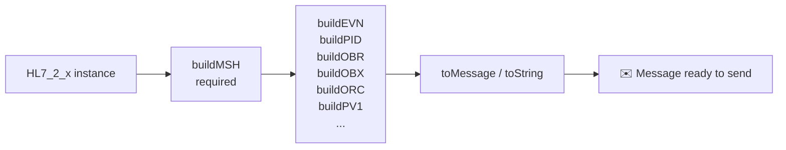
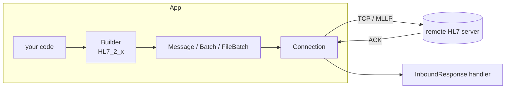

# 🩺 Node HL7 Client

> A pure TypeScript HL7 client/builder/parser for Node.js — build, send, parse, and reply to HL7 v2.x messages over MLLP. For the receiving side, see the companion [`node-hl7-server`](https://www.npmjs.com/package/node-hl7-server) package.

`node-hl7-client` is a lightweight, **dependency-free** library for healthcare integrations. It speaks the traditional TCP/MLLP transport, ships typed builders for every HL7 v2.1 → 2.8 segment, parses inbound responses, and includes the `MLLPCodec` re‑used by [`node-hl7-server`](https://www.npmjs.com/package/node-hl7-server).

> ⭐ **Now part of the [`node-hl7` monorepo](https://github.com/Bugs5382/node-hl7).** The original standalone `node-hl7-client` repo collected a lot of stars over the years — thank you! Stars don't carry over to the new home, so if this package has been useful to you, please drop a ⭐ on the [monorepo](https://github.com/Bugs5382/node-hl7) so the new repo reflects the real community size. 🙏

## ✨ Features

- ⚡ **Zero runtime dependencies** — fast, small, easy to audit.
- 🧱 **Typed segment builders** — `HL7_2_1` through `HL7_2_8`, with `buildMSH`, `buildPID`, `buildEVN`, `buildOBX`, `buildORC`, … all the segments you actually use.
- 🧮 **Per-version field availability** — every segment carries an HL7 v2 usage code per version (R/O/B/W/D/X), sourced from the [Caristix HL7 Definition API](https://hl7-definition.caristix.com/v2/). Withdrawn fields throw, deprecated (B) fields warn, segments that didn't exist in your version are rejected. The full catalogue is exported as `SEGMENT_SPECS`.
- 🔗 **Chainable builders** — every `build*` returns the builder, so you can compose `new HL7_2_8().buildMSH(...).buildPID(...).toString()` top-to-bottom.
- 🧰 **`buildSegment(name, props)`** — universal spec-driven builder for the long tail of ~187 segments when a hand-tuned method isn't available.
- 🧬 **Typed composite inputs** — composite fields (`XAD`, `XPN`, `CWE`, `CX`, `EI`, `HD`, …) accept either a `^`-delimited string or a typed object: `pid_11: { streetAddress: "123 Elm St", city: "Springfield", stateOrProvince: "IL" }`. Per-component length, required, withdrawn, and not-supported rules are enforced.
- 🔁 **Auto reconnect & retry** — exponential backoff, configurable attempt cap.
- 🧠 **Pluggable queue** — default in‑memory, or wire it up to Redis / RabbitMQ / SQL.
- 📦 **Builder + Parser + Client** — one package covers send, receive, and round‑trip.
- 💻 **Cross‑platform** — Windows, macOS, Linux.
- 🤝 **Companion server** — pair with [`node-hl7-server`](https://www.npmjs.com/package/node-hl7-server) for full coverage.

## 📦 Install

```bash
npm install node-hl7-client
```

> 🟢 **Requires Node.js ≥ 22.**

## 🧾 Table of Contents

1. [Quick Start](#-quick-start)
2. [Building a Message (the new class‑based builder)](#-building-a-message-the-new-class-based-builder)
3. [Building Batches & Files](#-building-batches--files)
4. [Sending a Message](#-sending-a-message)
5. [TLS](#-tls)
6. [Mutual TLS (mTLS)](#-mutual-tls-mtls)
7. [Parsing Replies](#-parsing-replies)
8. [Custom Queues (Redis, etc.)](#-custom-queues-redis-etc)
9. [Architecture](#-architecture)
10. [Detailed Docs](#-detailed-docs)
11. [Keyword Definitions](#-keyword-definitions)
12. [License](#-license)

---

## 🚀 Quick Start

```ts
import Client, { HL7_2_5 } from "node-hl7-client";

// 1) Build an ADT^A01. Every build* returns the builder, so you can chain.
const message = new HL7_2_5()
  .buildMSH({
    msh_3: "MY_APP",
    msh_4: "MY_FAC",
    msh_5: "EPIC",
    msh_6: "HOSP",
    msh_9: "ADT^A01",
    msh_10: "MSG00001",
    msh_11: "P",
  })
  .buildEVN({ evn_1: "A01" })
  .buildPID({
    pid_3: "MRN12345",
    pid_5: "DOE^JANE^A",
    pid_7: new Date("1980-01-01"),
    pid_8: "F",
  })
  .toMessage();

// 2) Open a persistent connection and send it.
const client = new Client({ host: "127.0.0.1" });
const conn = client.createConnection({ port: 3000 }, async (res) => {
  console.log("✅ ACK:", res.getMessage().get("MSA.1").toString()); // AA
});
await conn.sendMessage(message);
```

The class‑based builder validates segment fields against HL7 tables (e.g. allowed values for `MSH.11`, `MSA.1`, `PV1.2`) **and** against per-version usage codes from the published HL7 spec — it rejects withdrawn fields (`W`/`X`), warns on backward-compatibility ones (`B`), and refuses segments that didn't exist in the active version. Bad input raises `HL7ValidationError`; the result is a real `Message` you can keep mutating with `message.set("PID.13", ...)`, `message.addSegment("OBX")`, and so on.

---

## 🧱 Building a Message (the new class‑based builder)



### Step 1 — Pick a version

```ts
import { HL7_2_3, HL7_2_4, HL7_2_5, HL7_2_6, HL7_2_7, HL7_2_8 } from "node-hl7-client";

const builder = new HL7_2_5({
  // Optional: override the default date format.
  // "8" = YYYYMMDD, "12" = YYYYMMDDHHMM, "14" = YYYYMMDDHHMMSS (default).
  date: "14",
  // Optional: hardError = true makes validation issues throw immediately.
  hardError: true,
});
```

### Step 2 — Build MSH (always first)

```ts
builder.buildMSH({
  msh_3: "SENDING_APP",
  msh_4: "SENDING_FAC",
  msh_5: "RECEIVING_APP",
  msh_6: "RECEIVING_FAC",
  msh_9: "ADT^A01",        // 2.4+ accepts the composite directly
  msh_10: "MSG00001",      // control id; auto‑randomized if omitted
  msh_11: "P",             // P = production, T = test
});
```

> ⚠️ Calling any other `build*` method before `buildMSH` throws `HL7FatalError("MSH Header must be built first.")`.

### Step 3 — Build segments

Each version‑specific class exposes the segments that are valid for that version. Common ones include:

| Builder | Segment | Notes |
|---|---|---|
| `buildEVN(props)` | EVN | Event type/timestamps for ADT messages. |
| `buildPID(props)` | PID | Patient identification. |
| `buildPV1(props)` | PV1 | Patient visit. |
| `buildOBR(props)` | OBR | Observation request. |
| `buildOBX(props)` | OBX | Observation result. |
| `buildORC(props)` | ORC | Common order. |
| `buildNTE(props)` | NTE | Notes & comments. |
| `buildMSA(props)` | MSA | Used when **building** ACKs by hand. |
| `buildERR(props)` | ERR | Error segment. |

```ts
builder.buildEVN({ evn_1: "A01", evn_2: new Date() });

builder.buildPID({
  pid_3: "MRN12345",                           // patient id
  pid_5: "DOE^JANE^A",                         // last^first^middle
  pid_7: new Date("1980-01-01"),               // DOB (Date or string)
  pid_8: "F",                                  // sex (validated against TABLE_0001)
  pid_11: "123 ELM ST^^SPRINGFIELD^IL^62701",  // address
});

builder.buildOBX({
  obx_1: "1",
  obx_2: "TX",
  obx_3: "NOTE^Discharge Note^L",
  obx_5: "Patient stable, discharged home.",
  obx_11: "F",                                  // status (validated against TABLE_0085)
});
```

> 💡 Most fields accept either positional names (`pid_5`) or human‑friendly aliases (`patientName`). Pick whichever is clearer at the call site.

### 🎨 Composite values: pass the whole HL7 string

The builder treats every prop as a literal field value, so you can embed HL7 delimiters directly instead of building components piece‑by‑piece. This is what makes the typed builder feel *fun* — short, declarative, and easy to template from another data source.

```ts
builder.buildMSH({ msh_9: "ADT^A01" });                                  // composite trigger
builder.buildPID({
  pid_5: "DOE^JANE^A",                                                   // last^first^middle
  pid_11: "123 ELM ST^^SPRINGFIELD^IL^62701",                            // ^^ skips a component
  pid_13: "555-0100~555-0200",                                           // ~ separates repetitions
});
builder.buildOBX({ obx_3: "NOTE^Discharge Note^L" });                    // identifier^text^codingSystem
```

| Delimiter | Means | Example |
|:---:|---|---|
| `^` | next component | `"DOE^JANE^A"` |
| `&` | next sub‑component | `"123 ELM ST&APT 4^^CITY"` |
| `~` | next repetition | `"555-0100~555-0200"` |
| `^^` | leave a component empty | `"ST^^CITY^STATE^ZIP"` |

If you've changed the encoding characters via the builder constructor, use **those** characters in your composite strings instead — see [composite docs](../../pages/client/builder/index.md#-composite-values-inline--pass-the-whole-string).

### Step 4 — Convert

```ts
const message = builder.toMessage();    // returns a Message
const text    = builder.toString();     // returns the HL7 text
```

The resulting MSH for the example above:

```text
MSH|^~\&|SENDING_APP|SENDING_FAC|RECEIVING_APP|RECEIVING_FAC|20240101000000||ADT^A01|MSG00001|P|2.5
EVN|A01|20240101000000
PID|||MRN12345||DOE^JANE^A||19800101|F|||123 ELM ST^^SPRINGFIELD^IL^62701
OBX|1|TX|NOTE^Discharge Note^L||Patient stable, discharged home.||||||F
```

### 🛠️ Direct edits with `message.set(...)`

`toMessage()` returns a real `Message` you can keep mutating after the builder is done — useful for fields the builder doesn't surface:

```ts
const msg = builder.toMessage();
msg.set("PID.13", "555-0100");                 // home phone
msg.set("PV1.7").set(0).set(1, "Jones").set(2, "John"); // chained repetitions
```

### Encoding characters

Defaults are the HL7 standard: `|` field, `^` component, `&` subcomponent, `~` repetition, `\` escape. To send through a system that uses non‑standard delimiters, set them once on the builder options:

```ts
const builder = new HL7_2_5({
  separatorField: "!",
  separatorComponent: "+",
  separatorSubComponent: "]",
  separatorRepetition: "?",
  separatorEscape: "#",
});
```

These cannot be changed via `set()` — they're embedded in `MSH.1` and `MSH.2`.

---

## 📚 Building Batches & Files

```ts
import { Batch, FileBatch, HL7_2_5 } from "node-hl7-client";

// A batch is just multiple messages wrapped in BHS / BTS.
const batch = new Batch();
batch.start();
batch.add(makeMessage("MSG00001"));
batch.add(makeMessage("MSG00002"));
batch.end();

await conn.sendMessage(batch);

// A "file batch" is wrapped in FHS / FTS — useful for flat files
// for legacy systems and audit trails.
const file = new FileBatch();
file.start();
file.add(makeMessage("MSG00001"));
file.add(makeMessage("MSG00002"));
file.end();
fs.writeFileSync("ADT.20240101.hl7", file.toString());
```

Receivers process each inner message individually — `node-hl7-server` will invoke your handler once per message inside a batch or file.

---

## 📤 Sending a Message

```ts
import Client from "node-hl7-client";

const client = new Client({
  host: "127.0.0.1",
});

const OB_ADT = client.createConnection(
  {
    port: 3000,
    waitAck: true,                  // default: wait for ACK before next send
    maxConnectionAttempts: 10,      // reconnect attempts before giving up
  },
  async (res) => {
    const status = res.getMessage().get("MSA.1").toString();
    if (status !== "AA") console.warn("⚠️ rejected:", status);
  },
);

await OB_ADT.sendMessage(message);
await OB_ADT.close();
```

The connection is persistent; you can send many messages over a single TCP/MLLP socket.

### 🌐 IPv4 + IPv6 (Dual-Stack)

The client supports IPv4, IPv6, and FQDN hosts. **It runs IPv4-only by default.** Opt into dual-stack by setting both `ipv4: true` and `ipv6: true` — when the host name then resolves to both A (IPv4) and AAAA (IPv6) records, Node's [Happy-Eyeballs algorithm](https://nodejs.org/api/net.html#netconnectoptions-connectlistener) races both attempts and uses whichever wins, so a remote with a stale or unreachable AAAA record silently falls back to its IPv4 address (and vice versa).

```ts
// IPv4 only (default)
const client = new Client({ host: "hl7.example.com" });

// Dual-stack with auto-fallback (opt-in)
const dual = new Client({ host: "hl7.example.com", ipv4: true, ipv6: true });

// Force IPv6 only
const v6Only = new Client({ host: "fd00::42", ipv6: true });

// Pin a specific termination address (when the host has multiple)
const pinned = new Client({ host: "fe80::1234", ipv6: true });

// Tune Happy-Eyeballs cadence (defaults shown — only takes effect in dual-stack):
const tuned = new Client({
  host: "hl7.example.com",
  ipv4: true,
  ipv6: true,
  autoSelectFamily: true,             // default
  autoSelectFamilyAttemptTimeout: 250, // ms before racing the other family
});
```

| Option | Meaning |
|---|---|
| (defaults) | IPv4 only — host literal must be IPv4 |
| `ipv4: true, ipv6: true` | dual-stack with Happy-Eyeballs fallback |
| `ipv6: true` only | force IPv6 — host literal must be IPv6 |
| `autoSelectFamily: false` | disable Happy-Eyeballs (use the OS-default order) |

> 💡 Passing only **one** of `ipv4` / `ipv6` is treated as exclusive — IP literals are validated against that family. Setting both to `false` throws.

---

## 🔒 TLS

Pass `tls: true` to use the system trust store, or a `tls` object for full [`tls.ConnectionOptions`](https://nodejs.org/api/tls.html#tlsconnectoptions-callback) control:

```ts
import fs from "node:fs";
import path from "node:path";
import Client from "node-hl7-client";

const client = new Client({
  host: "hl7.example.local",
  tls: {
    // ✅ Validate the server's certificate (production default).
    rejectUnauthorized: true,
    // 🪪 Self-signed / in-house CA? Provide it explicitly.
    ca: fs.readFileSync(path.join("certs", "server-ca-crt.pem")),
  },
});

const OB_ADT = client.createConnection({ port: 6661 }, async (res) => {
  console.log("✅", res.getMessage().get("MSA.1").toString());
});

await OB_ADT.sendMessage(message);
```

> 🚨 Set `rejectUnauthorized: true` in production. The `false` form skips cert validation entirely — fine for local dev, dangerous on the open network.

The shorthand `tls: true` is also accepted when the server uses a cert chained to a public CA already in Node's trust store:

```ts
const client = new Client({ host: "hl7.example.com", tls: true });
```

---

## 🛡️ Mutual TLS (mTLS)

Many hospital networks require **client-certificate authentication**. Provide your own `key` + `cert` so the server can validate *you* in addition to validating the server cert:

```ts
import fs from "node:fs";
import path from "node:path";
import Client from "node-hl7-client";

const client = new Client({
  host: "hl7.example.local",
  tls: {
    // 🔑 The client's identity — what the remote server validates.
    key: fs.readFileSync(path.join("certs", "client-key.pem")),
    cert: fs.readFileSync(path.join("certs", "client-crt.pem")),

    // 🪪 The CA(s) you trust to issue the server's certificate.
    ca: fs.readFileSync(path.join("certs", "server-ca-crt.pem")),

    // ✅ Always validate the server cert.
    rejectUnauthorized: true,

    // (Optional) Pin the server's expected hostname when it differs from `host`.
    // servername: "hl7.example.local",
  },
});

const OB_ADT = client.createConnection({ port: 6661 }, async (res) => {
  console.log("✅", res.getMessage().get("MSA.1").toString());
});

await OB_ADT.sendMessage(message);
```

| Option | What it does |
|---|---|
| `key` + `cert` | Your client identity. The server validates these against its trusted CAs. |
| `ca` | The trusted issuer(s) for the **server**'s certificate. |
| `rejectUnauthorized` | If `true`, the connection drops on any cert validation error. Always `true` in production. |
| `servername` | SNI / expected server hostname. Defaults to `host`; override only if the cert CN differs. |
| `passphrase` | Passphrase for an encrypted private key. |

> 💡 The matching server-side configuration lives in [`node-hl7-server`](https://www.npmjs.com/package/node-hl7-server) — see its [TLS / mTLS docs](../node-hl7-server/README.md#-mutual-tls-mtls).

---

## 🔍 Parsing Replies

The same `Message` class powers parsing:

```ts
import { Message, Batch, FileBatch } from "node-hl7-client";

const msg = new Message({ text: hl7String });
msg.get("MSH.9.1").toString();   // ADT
msg.get("PID.5.1").toString();   // DOE

// Batches and files:
new Batch({ text: hl7BatchString }).messages().forEach((m) => { /* ... */ });
new FileBatch({ fullFilePath: "ADT.20240101.hl7" }).messages().forEach(/* ... */);
```

> ⚠️ The parser is strict — malformed HL7 throws. Wrap untrusted input in a try/catch.

---

## 🧰 Custom Queues (Redis, etc.)

By default outbound messages are queued in memory, capped at 10,000 per connection. For Kubernetes or any multi‑pod deployment, **offload the queue** to Redis (preferred) or another durable store so messages survive pod restarts:

```ts
import { createClient } from "@redis/client";
import Client, { Message, MessageItem, NotifyPendingCount } from "node-hl7-client";

const redis = createClient();
await redis.connect();

const enqueueMessage = async (msg: MessageItem, notify: NotifyPendingCount) => {
  await redis.lPush("hl7queue", msg.toString());
  await notify(await redis.lLen("hl7queue"));
};

const flushQueue = async (
  callback: (m: MessageItem) => void,
  notify: NotifyPendingCount,
) => {
  while ((await redis.lLen("hl7queue")) > 0) {
    const popped = await redis.blPop("hl7queue", 1);
    if (popped?.element) {
      callback(new Message({ text: popped.element }));
      await notify(await redis.lLen("hl7queue"));
    }
  }
};

const client = new Client({ host: "127.0.0.1" });
const conn = client.createConnection(
  { port: 3000, autoConnect: false, enqueueMessage, flushQueue },
  async () => {},
);
```

> 🔐 **Tag messages per client instance** if you share a queue across services — otherwise pod A might dequeue messages destined for pod B.

---

## 🏗️ Architecture



---

## 📖 Detailed Docs

- [Builder walkthrough](../../pages/client/builder/index.md)
- [Client / connection](../../pages/client/client/index.md)
- [Parser](../../pages/client/parser/index.md)
- [API reference (typedoc)](https://bugs5382.github.io/node-hl7-client/)

---

## 📚 Keyword Definitions

The terms **MUST**, **MUST NOT**, **REQUIRED**, **SHALL**, **SHALL NOT**, **SHOULD**, **SHOULD NOT**, **RECOMMENDED**, **MAY**, and **OPTIONAL** in this documentation follow [RFC 2119](https://www.rfc-editor.org/rfc/rfc2119) semantics.

> ⚠️ **Capitalization matters.** These keywords carry their RFC 2119 meaning **only when written in ALL CAPS**. The lowercase forms (`must`, `should`, `may`, …) are normal English and are not normative.

## 🤝 Contributing

Contributions are welcome — bug fixes, new HL7 version coverage, more detailed docs, parser improvements, anything.

1. 🍴 Fork the repo and create a topic branch off `main`.
2. ✅ Add or update tests under `__tests__/client/` for any behavior change. The full suite runs with `npx vitest run`.
3. 🧹 Lint with `npm run lint` from the repo root and format with the existing eslint config.
4. 📝 Use one of the [issue templates](https://github.com/Bugs5382/node-hl7-client/issues/new/choose) when opening an issue, and reference the issue number in your PR description.
5. 🚀 Open a PR against `main`. CI will run lint + tests on every push.

For larger changes, please open a [discussion](https://github.com/Bugs5382/node-hl7-client/issues/new?template=feature_request.md) first so we can align on scope before code review.

## 🙏 Acknowledgements

- [`node-rabbitmq-client`](https://github.com/cody-greene/node-rabbitmq-client) — connection design inspiration.
- [`artifacthealth/hl7parser`](https://github.com/artifacthealth/hl7parser) — parser/builder design reference.

### 👨‍👩‍👧‍👦 Family

A special thanks to my wife, daughter, and son for their patience while I work in "geek mode." 💚

## 📄 License

[MIT](./LICENSE) © Shane Froebel
