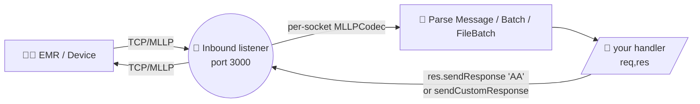
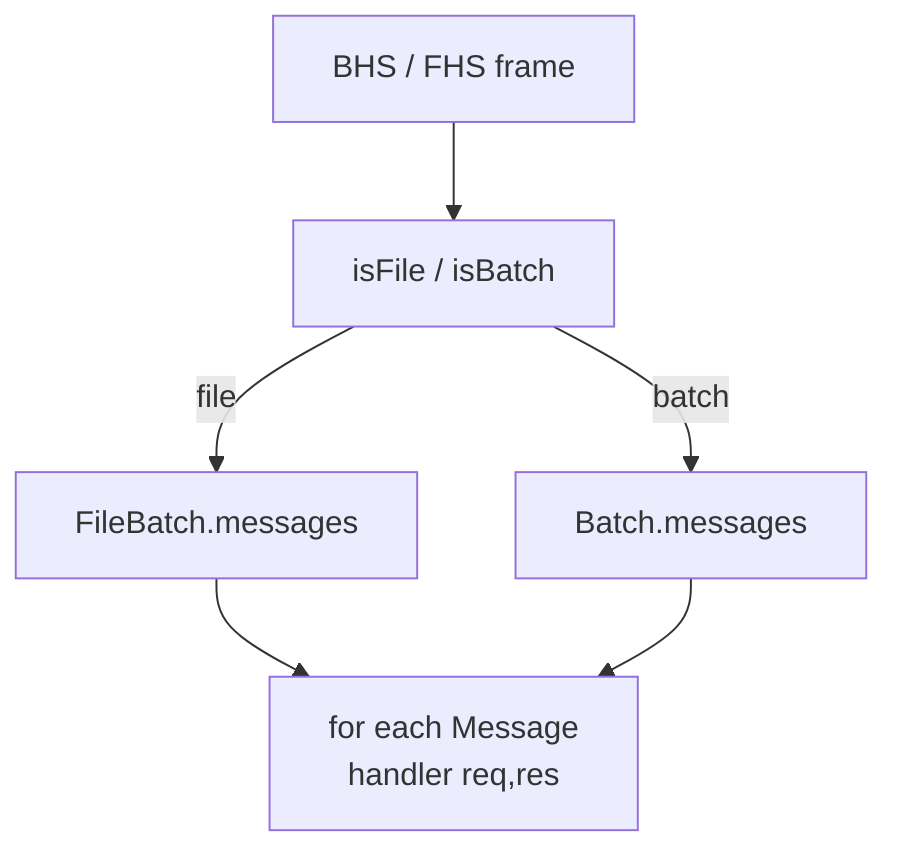

# 🏥 Node HL7 Server

> A pure TypeScript HL7 listener for Node.js — accept, parse, acknowledge, and route HL7 v2.x messages over MLLP.

`node-hl7-server` is a lightweight, dependency-light TCP/MLLP listener built for high‑throughput hospital integrations. It accepts properly framed HL7 messages, parses them with [`node-hl7-client`](https://www.npmjs.com/package/node-hl7-client), hands them to your handler, and lets you reply with auto‑generated or fully custom ACKs.

> ⭐ **Now part of the [`node-hl7` monorepo](https://github.com/Bugs5382/node-hl7).** The original standalone `node-hl7-server` repo collected a lot of stars over the years — thank you! Stars don't carry over to the new home, so if this package has been useful to you, please drop a ⭐ on the [monorepo](https://github.com/Bugs5382/node-hl7) so the new repo reflects the real community size. 🙏

## ✨ Features

- 🧵 **MLLP framing built in** — handles `<VT>…<FS><CR>` framing, including TCP fragmentation across many `data` events.
- 🔁 **Per‑connection codec** — concurrent clients never interleave each other's buffers.
- 🤝 **Auto ACK** — send `AA` / `AR` / `AE` / `CA` / `CR` / `CE` with a single call, or build your own.
- 🧩 **Custom ACK** — `sendCustomResponse()` writes a verbatim, vendor‑shaped acknowledgement.
- 🛡️ **TLS + mTLS** — both server‑auth and mutual‑auth modes are first‑class.
- 🧱 **Override MSH fields** — set static or callback‑computed values on every reply.
- 🔌 **Socket access** — `req.getSocket()` for `localAddress`, `localPort`, `remoteAddress`, etc.
- ⚡ **Tiny dep tree** — only depends on its sister, `node-hl7-client`. No heavyweight HL7 framework.
- 🧠 **Fully typed** — TypeScript-first with rich JSDoc.

## 📦 Install

```bash
npm install node-hl7-server
```

The only runtime dependency is [`node-hl7-client`](https://www.npmjs.com/package/node-hl7-client) — it produces the ACK objects and parses incoming MLLP frames.

> 🟢 **Requires Node.js ≥ 22.**

## 🧾 Table of Contents

1. [Quick Start](#-quick-start)
2. [How it Works](#-how-it-works)
3. [Server Options](#-server-options)
4. [Inbound Listener Options](#-inbound-listener-options)
5. [Reading the Request](#-reading-the-request)
6. [Sending an ACK](#-sending-an-ack)
   - [Standard ACK (`sendResponse`)](#standard-ack-sendresponse)
   - [Custom ACK (`sendCustomResponse`)](#custom-ack-sendcustomresponse)
   - [MSH Field Overrides](#msh-field-overrides)
7. [Batches & File Batches](#-batches--file-batches)
8. [TLS](#-tls)
9. [Mutual TLS (mTLS)](#-mutual-tls-mtls)
10. [Concurrent Connections & MLLP Framing](#-concurrent-connections--mllp-framing)
11. [Performance & Throughput](#-performance--throughput)
12. [Events](#-events)
13. [Docker](#-docker)
14. [Keyword Definitions](#-keyword-definitions)
15. [License](#-license)

---

## 🚀 Quick Start

```ts
import { Server } from "node-hl7-server";

const server = new Server({ bindAddress: "0.0.0.0" });

const IB_ADT = server.createInbound({ port: 3000 }, async (req, res) => {
  const message = req.getMessage();
  console.log("⬅️  received", message.get("MSH.10").toString());

  // Tell the sender we accepted it.
  await res.sendResponse("AA");
});

IB_ADT.on("listen", () => console.log("🎧 listening on :3000"));
```

A minimal **incoming** ADT^A01 looks like this on the wire (MLLP framing characters shown as `<VT>` / `<FS>` / `<CR>`):

```text
<VT>MSH|^~\&|EPIC|HOSP|RECV|RFAC|20240101000000||ADT^A01|MSG00001|P|2.5
EVN|A01|20240101000000
PID|1||MRN12345^^^HOSP^MR||DOE^JANE^A||19800101|F<CR><FS><CR>
```

…and the auto‑generated `AA` reply:

```text
<VT>MSH|^~\&|RECV|RFAC|EPIC|HOSP|20240101000005||ACK^A01|97f23ad1|P|2.5
MSA|AA|MSG00001<CR><FS><CR>
```

---

## 🧭 How it Works



Each TCP connection gets **its own** `MLLPCodec` instance. Bytes accumulate across `data` events until a complete `<VT>…<FS><CR>` frame is seen, and only then is the message handed to your handler. This keeps concurrent senders isolated and makes large messages (Epic OBX^TX records, base64 PDFs, etc.) safe even when the OS chops them into many TCP packets.

---

## ⚙️ Server Options

```ts
new Server(props?: ServerOptions);

interface ServerOptions {
  /** Where to bind. Default: 0.0.0.0 */
  bindAddress?: string;
  /** Encoding of inbound HL7 bytes. Default: utf-8 */
  encoding?: BufferEncoding;
  /** IPv4 only. Default: true */
  ipv4?: boolean;
  /** IPv6 only. Default: false */
  ipv6?: boolean;
  /** Forward additional net.connect options. */
  socket?: TcpSocketConnectOpts;
  /** Enable TLS / mTLS. See the TLS sections below. */
  tls?: TLSOptions;
}
```

> 💡 `ipv4` and `ipv6` are mutually exclusive. Setting both to `true` throws. The default is IPv4 only, and `bindAddress` must be a valid v4 / v6 address (or `localhost`).

---

## 🛎️ Inbound Listener Options

A single `Server` can host any number of listeners on different ports.

```ts
server.createInbound(props: ListenerOptions, handler: InboundHandler): Inbound;

interface ListenerOptions {
  /** Required. 0 < port < 65353. */
  port: number;
  /** Optional human‑readable name for logging. */
  name?: string;
  /** Encoding for inbound bytes. Default: utf-8 */
  encoding?: BufferEncoding;
  /** Per‑field MSH overrides applied to the auto-generated ACK. */
  mshOverrides?: Record<string, string | ((message: Message) => string)>;
  /** Plug in your own response class (must extend BaseSendResponse). */
  responseClass?: typeof BaseSendResponse;
}

type InboundHandler = (req: InboundRequest, res: SendResponse) => void;
```

The handler gets called **once per parsed message**, even when the inbound frame is a batch (BHS) or file (FHS) containing many messages.

---

## 📨 Reading the Request

```ts
server.createInbound({ port: 3000 }, async (req, res) => {
  const msg = req.getMessage();           // Message from node-hl7-client
  const type = req.getType();             // 'message' | 'batch' | 'file'
  const sock = req.getSocket();           // 🔌 the underlying net.Socket

  // Inspect any field, sub-field, or sub-sub-field:
  const mrn       = msg.get("PID.3").toString();
  const lastName  = msg.get("PID.5.1").toString();
  const firstName = msg.get("PID.5.2").toString();
  const version   = msg.get("MSH.12").toString(); // 2.5, 2.7, …

  // Use the socket for connection‑aware logic:
  console.log(`📨 ${mrn} from ${sock.remoteAddress} on :${sock.localPort}`);
});
```

| Method | Returns | Notes |
|---|---|---|
| `req.getMessage()` | `Message` | Full parsed message. Throws `HL7ListenerError` if missing. |
| `req.getType()` | `'message' \| 'batch' \| 'file'` | Tells you whether the frame was a single MSH, a BHS batch, or an FHS file. |
| `req.getSocket()` | `net.Socket` | Throws `HL7ListenerError` if the request was created without one. |

See the [parser docs](../../pages/client/parser/index.md) for the full Message / Batch / FileBatch reading API.

---

## 📬 Sending an ACK

### Standard ACK (`sendResponse`)

The library will mint an HL7‑spec ACK with sender/receiver swapped, the original `MSH.10` echoed in `MSA.2`, and an `MSH.9` of `ACK^<EventCode>`.

```ts
await res.sendResponse("AA"); // Application Accept
await res.sendResponse("AR"); // Application Reject
await res.sendResponse("AE"); // Application Error

// 2.2+ commit-level ACKs:
await res.sendResponse("CA"); // Commit Accept
await res.sendResponse("CR"); // Commit Reject
await res.sendResponse("CE"); // Commit Error

const ack = res.getAckMessage(); // the Message object that was sent
```

> ⚠️ **Version gate.** `CA` / `CR` / `CE` are valid only for HL7 ≥ 2.2. If the inbound message is `2.1`, the library will refuse and emit an `AE` instead. `AA` / `AR` / `AE` are valid on every version.

### Custom ACK (`sendCustomResponse`)

When the receiving system expects a vendor‑shaped acknowledgement (extra `MSA` fields, custom `ERR` segments, alternate `MSH.3`/`MSH.4`, etc.), build the message yourself and ship it verbatim:

```ts
import { Message, createHL7Date } from "node-hl7-client";

server.createInbound({ port: 3000 }, async (req, res) => {
  const original = req.getMessage();
  const ctrlId = original.get("MSH.10").toString();

  const ack = new Message({
    text: [
      `MSH|^~\\&|MY_APP|MY_FAC|EPIC|HOSP|${createHL7Date(new Date())}||ACK^A01|RESP_${ctrlId}|P|2.5`,
      `MSA|AA|${ctrlId}|All good|||MY_VENDOR_OK`,
      `ERR|||0^Message accepted^HL70357|I`,
    ].join("\r"),
  });

  await res.sendCustomResponse(ack);     // Message instance
  // -- or --
  await res.sendCustomResponse(rawHl7);  // raw string
});
```

`sendCustomResponse` performs **no MSA-1 validation, no MSH overrides, no auto-swap of sender/receiver**. You are in full control of the bytes on the wire — that is the whole point. The custom message becomes `res.getAckMessage()` afterwards.

### MSH Field Overrides

When the auto‑ACK is *almost* right but a couple of MSH fields need tweaking (a different `MSH.3`, a calculated timestamp, a vendor‑specific `MSH.18`), set `mshOverrides`. Each entry is either a literal value or a callback that receives the inbound `Message`:

```ts
import { format } from "date-fns";

server.createInbound(
  {
    port: 3000,
    mshOverrides: {
      "3": "MY_APP",                                              // literal
      "7": () => format(new Date(), "yyyyMMddHHmmssxx"),          // callback
      "9.3": "ACK",                                               // literal
      "12": (msg) => msg.get("MSH.12").toString(),                // copy from inbound
      "18": "UNICODE UTF-8",                                      // literal
    },
  },
  async (req, res) => {
    await res.sendResponse("AA");
  },
);
```

Overrides apply only to `sendResponse(...)`. They are intentionally skipped by `sendCustomResponse(...)`.

---

## 📚 Batches & File Batches

If the sender ships a BHS‑wrapped batch or an FHS‑wrapped file, **the listener invokes your handler once per inner message** (each with its own `req` and `res`). You don't need to write any extra code — `req.getType()` simply returns `'batch'` or `'file'` instead of `'message'`.



---

## 🔒 TLS

For **server‑authenticated** TLS (the client validates your cert, but not vice‑versa):

```ts
import fs from "node:fs";
import path from "node:path";
import { Server } from "node-hl7-server";

const server = new Server({
  tls: {
    key: fs.readFileSync(path.join("certs", "server-key.pem")),
    cert: fs.readFileSync(path.join("certs", "server-crt.pem")),
    rejectUnauthorized: false,
  },
});
```

Everything else (listeners, handlers, ACKs) works identically — `node-hl7-server` simply swaps the underlying socket from `net.Socket` to `tls.TLSSocket`. `req.getSocket()` will return the TLS socket so you can read peer details.

---

## 🛡️ Mutual TLS (mTLS)

Many hospital environments require **client‑certificate authentication** in addition to server certs. `node-hl7-server` supports this directly through the `tls` options:

```ts
import fs from "node:fs";
import path from "node:path";
import { Server } from "node-hl7-server";

const server = new Server({
  tls: {
    // 🔑 Server identity — what every connecting client validates.
    key: fs.readFileSync(path.join("certs", "server-key.pem")),
    cert: fs.readFileSync(path.join("certs", "server-crt.pem")),

    // 🤝 mTLS — demand a client certificate and validate it.
    requestCert: true,
    rejectUnauthorized: true,
    ca: [
      fs.readFileSync(path.join("certs", "trusted-client-ca.pem")),
      // Multiple CAs are fine — list every issuer you trust.
    ],
  },
});

const IB = server.createInbound({ port: 6661 }, async (req, res) => {
  // The TLS handshake has already enforced the client cert.
  // You can still inspect peer details via the socket:
  const sock = req.getSocket() as import("tls").TLSSocket;
  const peer = sock.getPeerCertificate();
  console.log("🤝 mTLS peer:", peer.subject?.CN);

  await res.sendResponse("AA");
});
```

| Option | What it does |
|---|---|
| `requestCert: true` | The server asks the client to present a certificate during the handshake. |
| `rejectUnauthorized: true` | Connections are dropped if the client's cert isn't signed by one of the trusted CAs. |
| `ca: Buffer[]` | The set of trusted client‑CA certificates. |

> 🚨 **Don't** set `rejectUnauthorized: false` in production. That's `requestCert` without enforcement and is functionally equivalent to "anyone can connect." Use it only for local development.

---

## 🧩 Concurrent Connections & MLLP Framing

Every connection gets its own `MLLPCodec`. That matters because:

1. Two simultaneous senders won't have their byte streams concatenated mid-frame.
2. A single large message can arrive over **dozens** of TCP packets and the codec will buffer correctly until it sees `<FS><CR>`. This was the root cause of intermittent `"text must begin with the MSH segment"` errors that some users reported with very large ADT^A08 payloads from Epic.

You normally never touch the codec — but if you need to write back through the same socket from a custom handler, both the codec and the socket are exposed on `res`:

```ts
const codec = res.getCodec();   // MLLPCodec on the BaseSendResponse
const sock  = res.getSocket();  // net.Socket / tls.TLSSocket
codec.sendMessage(sock, customString, "utf-8");
```

---

## ⚡ Performance & Throughput

For typical HL7 traffic patterns (e.g. **~60,000 ADT messages/day ≈ 0.7 msg/s sustained**, with bursts up to a few hundred per minute), `node-hl7-server` runs comfortably on a single Node.js process. The unit tests include a 200‑message burst test that completes in well under a second on commodity hardware with no drops.

Recommendations for higher‑throughput deployments:

- 🚀 **Multiple ports per workflow.** Many HL7 environments dedicate a port per message type (e.g. ADT on 6661, ORU on 6662). Just call `server.createInbound(...)` once per port — they all share the same `Server`.
- 📦 **Don't do heavy work in the handler.** Acknowledge first (`res.sendResponse("AA")`), then push the parsed `Message` onto a queue (Redis, RabbitMQ, SQS) for downstream processing. This minimizes back‑pressure on the sender.
- 🧮 **Use TLS termination at the edge** if your CPU is the bottleneck — a sidecar (envoy, nginx) handling TLS lets you keep the server in plain TCP locally.
- 🎯 **Monitor `Inbound.stats`** — `received` (frames) and `totalMessage` (parsed messages) are incremented in real time.

> 💡 If you ever see `data.error` events, your sender may be producing malformed MLLP frames or the TCP path is dropping bytes. Log these — they're rare in practice.

---

## 📡 Events

The `Inbound` class extends `EventEmitter`. The events worth listening to:

| Event | Payload | When |
|---|---|---|
| `listen` | _none_ | The TCP/TLS server has bound and is accepting connections. |
| `client.connect` | `socket: Socket` | A new client connected. |
| `client.close` | `hadError: boolean` | A client disconnected. |
| `client.error` | `err: Error` | Per‑connection error (will close the socket). |
| `error` | `err: Error` | The underlying TCP/TLS server emitted an error. |
| `data.raw` | `string` | The full MLLP message payload, just before parsing. Useful for debug logging / capture. |
| `data.error` | `err: Error` | A frame couldn't be parsed (malformed HL7, unexpected bytes, etc.). |
| `response.sent` | _none_ | An ACK was just written to the socket. |

```ts
IB_ADT.on("client.connect", (s) => console.log("🤝", s.remoteAddress));
IB_ADT.on("data.raw",       (raw) => console.log("📥", raw.length, "bytes"));
IB_ADT.on("response.sent",  () => console.log("✅ ACK sent"));
IB_ADT.on("data.error",     (err) => console.error("💥 parse error", err));
```

---

## 🐳 Docker

The repo ships with a `Dockerfile` that runs `docker/server.js` — a minimal listener that responds `AA` to every well‑formed message.

```bash
npm run docker:build
docker run --rm -p 3000:3000 docker-node-hl7-server:latest
```

Edit `docker/server.js` (or the TLS variant `docker/tls.server.js`) to drop in your own handler before building.

---

## 📚 Keyword Definitions

This NPM package supports medical applications with potential impact on patient care and diagnoses. The terms **MUST**, **MUST NOT**, **REQUIRED**, **SHALL**, **SHALL NOT**, **SHOULD**, **SHOULD NOT**, **RECOMMENDED**, **MAY**, and **OPTIONAL** in the documentation follow [RFC 2119](https://www.rfc-editor.org/rfc/rfc2119) semantics.

> ⚠️ **Capitalization matters.** These keywords carry their RFC 2119 meaning **only when written in ALL CAPS**. The lowercase forms (`must`, `should`, `may`, …) are normal English and are not normative.

---

## 🔗 See Also

- 📖 [Detailed pages docs](../../pages) — server & client deep‑dives, builder/parser walkthroughs, flow diagrams.
- 🧱 [`node-hl7-client`](https://www.npmjs.com/package/node-hl7-client) — the sister package for sending messages and building Message / Batch / FileBatch objects.
- 🌐 [GitHub Pages site](https://bugs5382.github.io/node-hl7-server/) — typedoc API reference.
- 🩺 [HL7 v2 specification](https://www.hl7.org/implement/standards/index.cfm?ref=nav) — the canonical reference for everything segment- and field-related.

## 🤝 Contributing

Contributions are welcome — bug fixes, new features, more detailed docs, additional HL7 segment validators, you name it.

1. 🍴 Fork the repo and create a topic branch off `main`.
2. ✅ Add or update tests under `__tests__/server/` for any behavior change. The full suite runs with `npx vitest run`.
3. 🧹 Lint with `npm run lint` from the repo root and format with the existing eslint config.
4. 📝 Use one of the [issue templates](https://github.com/Bugs5382/node-hl7-server/issues/new/choose) when opening an issue, and reference the issue number in your PR description.
5. 🚀 Open a PR against `main`. CI will run lint + tests on every push.

For larger changes, please open a [discussion](https://github.com/Bugs5382/node-hl7-server/issues/new?template=feature_request.md) first so we can align on scope before code review.

## 🙏 Acknowledgements

- [`node-rabbitmq-client`](https://github.com/cody-greene/node-rabbitmq-client) – Connection logic inspiration.

### 👨‍👩‍👧‍👦 Family

A special thanks to my wife, daughter, and son for their patience while I work in "geek mode." 💚

## 📄 License

[MIT](./LICENSE) © Shane Froebel
