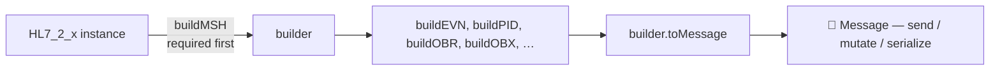

# 🧱 Node HL7 Client :: Builder

> Build valid HL7 v2.x messages with typed segment builders. The **new** class‑based format validates fields against HL7 tables, raises clear errors, and lets you keep the parsed `Message` for further edits.

## 🧾 Table of Contents

1. [The big picture](#-the-big-picture)
2. [Pick a version (`HL7_2_x`)](#-pick-a-version-hl7_2_x)
3. [Build the MSH (always first)](#-build-the-msh-always-first)
4. [Build the rest of your segments](#-build-the-rest-of-your-segments)
5. [Date formats](#-date-formats)
6. [Encoding characters](#-encoding-characters)
7. [Direct edits with `message.set(...)`](#-direct-edits-with-messageset)
8. [Building Batches](#-building-batches)
9. [Building File Batches](#-building-file-batches)
10. [Refactor pattern: factory functions](#-refactor-pattern-factory-functions)
11. [Validation & errors](#-validation--errors)

---

## 🌐 The big picture



- **`HL7_2_x`** — the version-specific builder class (`HL7_2_3`, `HL7_2_5`, `HL7_2_7`, `HL7_2_8`). Every version inherits from `HL7_BASE` and adds segments that were introduced in that version.
- **`buildMSH(props)`** — must be called first. Anything else throws `MSH Header must be built first.`
- **`build<SEG>(props)`** — every other segment has a typed builder.
- **`toMessage()`** — returns a real `Message` object you can keep editing or send straight to `Connection.sendMessage(...)`.
- **`toString()`** — returns the framed HL7 text.

> 💡 The builder is **not** the parser. To turn a string back into a `Message`, use `new Message({ text })`. See the [parser docs](../parser/index.md).

---

## 🎯 Pick a version (`HL7_2_x`)

```ts
import {
  HL7_2_1,
  HL7_2_2,
  HL7_2_3,
  HL7_2_3_1,
  HL7_2_4,
  HL7_2_5,
  HL7_2_5_1,
  HL7_2_6,
  HL7_2_7,
  HL7_2_7_1,
  HL7_2_8,
} from "node-hl7-client";

const builder = new HL7_2_5({
  /** Date format used when a Date is passed to a build* method.
   *  "8" → YYYYMMDD, "12" → YYYYMMDDHHMM, "14" → YYYYMMDDHHMMSS (default) */
  date: "14",

  /** When true, validation errors throw immediately instead of being
   *  collected as warnings. Recommended in dev/CI. */
  hardError: true,
});
```

| Version | Class | Notable additions |
|---|---|---|
| 2.1 | `HL7_2_1` | The minimal baseline. Composite `MSH.9.3` is **not** allowed. |
| 2.2 | `HL7_2_2` | Adds AL1 (allergy) and other segments. |
| 2.3 | `HL7_2_3` | Adds DG1, IN2, GT1 enhancements, ROL, etc. |
| 2.3.1 / 2.4 | `HL7_2_3_1`, `HL7_2_4` | `MSH.9.3` becomes optional / composite‑allowed. |
| 2.5 → 2.7.1 | `HL7_2_5`, `HL7_2_5_1`, `HL7_2_6`, `HL7_2_7`, `HL7_2_7_1` | Adds SFT, SPM, and many other segments. |
| 2.8 | `HL7_2_8` | Latest supported. Inherits from `HL7_2_7_1`. |

---

## 🏷️ Build the MSH (always first)

```ts
builder.buildMSH({
  msh_3: "SENDING_APP",         // Sending application
  msh_4: "SENDING_FAC",         // Sending facility
  msh_5: "RECEIVING_APP",       // Receiving application
  msh_6: "RECEIVING_FAC",       // Receiving facility
  // msh_7 (date) is auto‑set to "now" if you omit it
  msh_9: "ADT^A01",             // Composite (2.4+) or "ACK" / "ADT" (2.1)
  msh_10: "MSG00001",           // Auto-randomized if omitted
  msh_11: "P",                  // P=production, T=test
});
```

Resulting MSH (HL7 2.5):

```text
MSH|^~\&|SENDING_APP|SENDING_FAC|RECEIVING_APP|RECEIVING_FAC|20240101000000||ADT^A01|MSG00001|P|2.5
```

> ⚠️ **2.1 quirk.** `MSH.9.3` (composite event code) is forbidden in 2.1. The library throws if you try.

> 💡 Friendly aliases. Most builders accept either positional names (`msh_3`) or human aliases (`sendingApplication`). Use whichever reads better — both produce the same output.

---

## 🧬 Build the rest of your segments

Every version exposes typed builders for the segments it supports. Common examples:

### EVN — event timestamp (ADT)

```ts
builder.buildEVN({
  evn_1: "A01",                  // event type code
  evn_2: new Date(),             // recorded date (Date is auto‑formatted)
});
```

### PID — patient identification

```ts
builder.buildPID({
  pid_3: "MRN12345",                              // patient id (often the MRN)
  pid_5: "DOE^JANE^A",                            // last^first^middle
  pid_7: new Date("1980-01-01"),                  // DOB
  pid_8: "F",                                     // sex (validated, TABLE_0001)
  pid_11: "123 ELM ST^^SPRINGFIELD^IL^62701",     // address
  pid_13: "555-0100",                             // home phone
});
```

Resulting PID:

```text
PID|||MRN12345||DOE^JANE^A||19800101|F|||123 ELM ST^^SPRINGFIELD^IL^62701||555-0100
```

### OBX — observation

```ts
builder.buildOBX({
  obx_1: "1",
  obx_2: "TX",                                    // value type, TABLE_0125
  obx_3: "NOTE^Discharge Note^L",                 // observation identifier
  obx_5: "Patient stable, discharged home.",      // value
  obx_11: "F",                                    // status, TABLE_0085 (F = Final)
});
```

### MSA — message acknowledgement (when **building** ACKs by hand)

```ts
builder.buildMSA({
  msa_1: "AA",                                    // TABLE_0008
  msa_2: "MSG00001",                              // echoed control id
  msa_3: "All good",
});
```

### Other segments

`buildACC`, `buildBLG`, `buildDG1`, `buildDSC`, `buildEVN`, `buildFT1`, `buildGT1`, `buildIN1`, `buildMRG`, `buildNK1`, `buildNPU`, `buildNTE`, `buildOBR`, `buildORC`, `buildPR1`, `buildPV1`, `buildQRD`, `buildQRF`, `buildRX1`, `buildUB1`, `buildURD`, `buildURS`, `buildSFT`, `buildSPM`, … and more.

> 📚 The complete list per version is in the typedoc API reference; every method links to the corresponding [Caristix HL7 reference](https://hl7-definition.caristix.com/v2/).

---

## 🎨 Composite values inline — pass the whole string

This is one of the **fun** parts of the builder format: every `build*` prop accepts a plain string, so you can embed HL7 composite syntax directly instead of building components piece‑by‑piece. The library treats whatever you pass as the field value and writes it through unchanged.

That means you can pre‑compose values — even from another data source, a template literal, or a CSV row — and just hand them to the builder.

```ts
builder.buildMSH({
  msh_9: "ADT^A01",                            // ⬅️ composite "MessageType^TriggerEvent"
  msh_10: "MSG00001",
  msh_11: "P",
});

builder.buildPID({
  pid_3: "MRN12345",
  pid_5: "DOE^JANE^A",                         // ⬅️ "Last^First^Middle"
  pid_11: "123 ELM ST^^SPRINGFIELD^IL^62701",  // ⬅️ "Street^^City^State^ZIP" (skipped subfield = ^^)
  pid_13: "555-0100~555-0200",                 // ⬅️ repetitions joined with ~
});

builder.buildOBX({
  obx_3: "NOTE^Discharge Note^L",              // ⬅️ "Identifier^Text^CodingSystem"
  obx_5: "Stable",
  obx_11: "F",
});
```

A quick map of the HL7 delimiters you'll most often use inside these strings:

| Delimiter | Means | Example value |
|:---:|---|---|
| `^` | next component (sub‑field) | `"DOE^JANE^A"` |
| `&` | next sub‑component | `"123 ELM ST&APT 4^^SPRINGFIELD"` |
| `~` | repetition (next occurrence of the same field) | `"555-0100~555-0200"` |
| `^^` | leave a component empty | `"123 ELM ST^^SPRINGFIELD^IL"` |

> 💡 Two equivalent ways to set `PV1.7` (attending doctor) with two repetitions:
>
> **Composite‑string style** — short and obvious:
> ```ts
> builder.buildPV1({ pv1_2: "I", pv1_7: "1234^Jones^John~5678^Smith^Bob" });
> ```
>
> **Chained `set()` style** — verbose but programmatic:
> ```ts
> const msg = builder.toMessage();
> msg.set("PV1.7").set(0).set(1, "Jones").set(2, "John");
> msg.set("PV1.7").set(1).set(1, "Smith").set(2, "Bob");
> ```
>
> Pick whichever reads better at the call site. Mixing them is also fine — build the bulk of the segment with composite strings, then drop down to `message.set(...)` for any odd field the builder doesn't surface.

> ⚠️ The default delimiters are `^`, `&`, `~`. If you've changed the encoding characters via the builder constructor (see [Encoding characters](#-encoding-characters)), use **those** characters in your composite strings — the library will not translate `^` to your custom component separator inside a value.

---

## 📅 Date formats

Pass a `Date` (or omit and let the builder pick "now"). The builder formats it according to the `date` option set on the constructor:

| `date` | Output | Example |
|---|---|---|
| `"8"` | `YYYYMMDD` | `20240101` |
| `"12"` | `YYYYMMDDHHMM` | `202401010930` |
| `"14"` (default) | `YYYYMMDDHHMMSS` | `20240101093015` |

```ts
const builder = new HL7_2_5({ date: "8" });
builder.buildEVN({ evn_1: "A01", evn_2: new Date() });
// EVN|A01|20240101
```

---

## 🔐 Encoding characters

Defaults — the HL7 standard:

| Character | Role |
|:---:|---|
| `\|` | Field separator |
| `^` | Component separator |
| `&` | Subcomponent separator |
| `~` | Repetition separator |
| `\\` | Escape character |

Override on the builder constructor (they're embedded in `MSH.1`/`MSH.2` and **cannot** be changed via `set()`):

```ts
const builder = new HL7_2_5({
  separatorField: "!",
  separatorComponent: "+",
  separatorSubComponent: "]",
  separatorRepetition: "?",
  separatorEscape: "#",
});
```

> 🚨 Receiving systems must agree on the delimiters in advance. The community default exists for a reason — change only when an integration partner requires it.

---

## ✏️ Direct edits with `message.set(...)`

`toMessage()` returns a real `Message` you can keep mutating after the builder is done. This is essential for fields the typed builders don't surface (e.g. obscure repetitions or custom Z‑segments).

> 💡 If you only need composites or repetitions on a field the builder *does* surface, you can usually skip `set(...)` chains entirely and pass an HL7 composite string straight to the builder prop — see [Composite values inline](#-composite-values-inline--pass-the-whole-string).

```ts
const msg = builder.toMessage();

// Set a single field:
msg.set("PID.13", "555-0100");

// Chain repetitions on a list field:
msg.set("PV1.7").set(0).set(1, "Jones").set(2, "John");
msg.set("PV1.7").set(1).set(1, "Smith").set(2, "Bob");

// Add a Z-segment:
const Z = msg.addSegment("ZDS");
Z.set("1", "VENDOR_SPECIFIC_VALUE");

console.log(msg.toString());
```

Output:

```text
…
PV1|||||||^Jones^John~^Smith^Bob
ZDS|VENDOR_SPECIFIC_VALUE
```

---

## 📚 Building Batches

A **batch** wraps multiple messages in BHS / BTS framing. Receivers process each inner message independently.

```ts
import { Batch } from "node-hl7-client";

const batch = new Batch();
batch.start();
batch.add(makeMessage("MSG00001"));
batch.add(makeMessage("MSG00002"));
batch.end();

await conn.sendMessage(batch);
```

```text
BHS|^~\&|SENDER|SF|RECV|RF|20240101000000
MSH|^~\&|…|MSG00001|P|2.5…
MSH|^~\&|…|MSG00002|P|2.5…
BTS|2
```

`node-hl7-server`'s `req.getType()` will return `'batch'` for each inner message.

---

## 🗄️ Building File Batches

A **file batch** wraps everything in FHS / FTS — handy for flat HL7 files exchanged with legacy systems and for audit trails.

```ts
import { FileBatch } from "node-hl7-client";
import fs from "node:fs";

const file = new FileBatch();
file.start();
file.add(makeMessage("MSG00001"));
file.add(makeMessage("MSG00002"));
file.end();

fs.writeFileSync("ADT.20240101.hl7", file.toString());
```

`req.getType()` → `'file'`. The library auto‑detects which framing was sent (`FHS` → file, `BHS` → batch, otherwise → single message).

---

## 🧰 Refactor pattern: factory functions

When you send the same shape of message over and over, wrap the builder in a factory:

```ts
import { HL7_2_5, Message } from "node-hl7-client";

const createADT_A01 = (mrn: string, name: string, ctrlId: string): Message => {
  const b = new HL7_2_5();
  b.buildMSH({
    msh_3: "MY_APP",
    msh_4: "MY_FAC",
    msh_5: "EPIC",
    msh_6: "HOSP",
    msh_9: "ADT^A01",
    msh_10: ctrlId,
    msh_11: "P",
  });
  b.buildEVN({ evn_1: "A01" });
  b.buildPID({ pid_3: mrn, pid_5: name, pid_8: "F" });
  return b.toMessage();
};

await conn.sendMessage(createADT_A01("MRN12345", "DOE^JANE^A", "MSG00001"));
await conn.sendMessage(createADT_A01("MRN67890", "ROE^JOHN^B", "MSG00002"));
```

Keeps callsites readable and test fixtures consistent.

---

## 🛟 Validation & errors

The builders validate against HL7 tables (e.g. `MSA.1` against `TABLE_0008`, `PID.8` against `TABLE_0001`, `PV1.2` against `TABLE_0004`, …). Bad values throw `HL7ValidationError`.

```ts
try {
  builder.buildPID({ pid_8: "Q" }); // not in TABLE_0001
} catch (err) {
  console.error("🛑", err.message);
}
```

> 💡 Set `hardError: true` on the constructor in development & CI so any deviation surfaces at build time, not on the wire.
