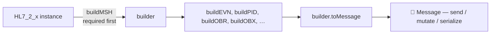

# 🧱 Node HL7 Client :: Builder

> Build valid HL7 v2.x messages with typed segment builders. The **new** class‑based format validates fields against HL7 tables, raises clear errors, and lets you keep the parsed `Message` for further edits.

## 🧾 Table of Contents

1. [The big picture](#-the-big-picture)
2. [Pick a version (`HL7_2_x`)](#-pick-a-version-hl7_2_x)
3. [Build the MSH (always first)](#-build-the-msh-always-first)
4. [Build the rest of your segments](#-build-the-rest-of-your-segments)
5. [Per-version field availability (usage codes)](#-per-version-field-availability-usage-codes)
6. [Chainable build methods](#-chainable-build-methods)
7. [`buildSegment` — generic spec-driven builder](#-buildsegment--generic-spec-driven-builder)
8. [Date formats](#-date-formats)
9. [Encoding characters](#-encoding-characters)
10. [Direct edits with `message.set(...)`](#-direct-edits-with-messageset)
11. [Building Batches](#-building-batches)
12. [Building File Batches](#-building-file-batches)
13. [Refactor pattern: factory functions](#-refactor-pattern-factory-functions)
14. [Validation & errors](#-validation--errors)

---

## 🌐 The big picture



- **`HL7_2_x`** — the version-specific builder class (`HL7_2_3`, `HL7_2_5`, `HL7_2_7`, `HL7_2_8`). Every version inherits from `HL7_BASE` and adds segments that were introduced in that version.
- **`buildMSH(props)`** — must be called first. Anything else throws `MSH Header must be built first.`
- **`build<SEG>(props)`** — every other segment has a typed builder.
- **`toMessage()`** — returns a real `Message` object you can keep editing or send straight to `Connection.sendMessage(...)`.
- **`toString()`** — returns the framed HL7 text.

> 💡 The builder is **not** the parser. To turn a string back into a `Message`, use `new Message({ text })`. See the [parser docs](../parser/index.md).

---

## 🎯 Pick a version (`HL7_2_x`)

```ts
import {
  HL7_2_1,
  HL7_2_2,
  HL7_2_3,
  HL7_2_3_1,
  HL7_2_4,
  HL7_2_5,
  HL7_2_5_1,
  HL7_2_6,
  HL7_2_7,
  HL7_2_7_1,
  HL7_2_8,
} from "node-hl7-client";

const builder = new HL7_2_5({
  /** Date format used when a Date is passed to a build* method.
   *  "8" → YYYYMMDD, "12" → YYYYMMDDHHMM, "14" → YYYYMMDDHHMMSS (default) */
  date: "14",

  /** When true, validation errors throw immediately instead of being
   *  collected as warnings. Recommended in dev/CI. */
  hardError: true,
});
```

| Version | Class | Notable additions |
|---|---|---|
| 2.1 | `HL7_2_1` | The minimal baseline. Composite `MSH.9.3` is **not** allowed. |
| 2.2 | `HL7_2_2` | Adds AL1 (allergy) and other segments. |
| 2.3 | `HL7_2_3` | Adds DG1, IN2, GT1 enhancements, ROL, etc. |
| 2.3.1 / 2.4 | `HL7_2_3_1`, `HL7_2_4` | `MSH.9.3` becomes optional / composite‑allowed. |
| 2.5 → 2.7.1 | `HL7_2_5`, `HL7_2_5_1`, `HL7_2_6`, `HL7_2_7`, `HL7_2_7_1` | Adds SFT, SPM, and many other segments. |
| 2.8 | `HL7_2_8` | Latest supported. Inherits from `HL7_2_7_1`. |

---

## 🏷️ Build the MSH (always first)

```ts
builder.buildMSH({
  msh_3: "SENDING_APP",         // Sending application
  msh_4: "SENDING_FAC",         // Sending facility
  msh_5: "RECEIVING_APP",       // Receiving application
  msh_6: "RECEIVING_FAC",       // Receiving facility
  // msh_7 (date) is auto‑set to "now" if you omit it
  msh_9_1: "ADT",               // Message code (MSH.9.1) — required
  msh_9_2: "A01",               // Trigger event (MSH.9.2) — required on 2.2+
  msh_10: "MSG00001",           // Auto-randomized if omitted
  msh_11_1: "P",                // Processing ID (MSH.11.1) — P=production, T=test
});
```

Resulting MSH (HL7 2.5):

```text
MSH|^~\&|SENDING_APP|SENDING_FAC|RECEIVING_APP|RECEIVING_FAC|20240101000000||ADT^A01^ADT_A01|MSG00001|P|2.5
```

> ⚠️ **MSH.9 / MSH.11 are keyed by component.** On **2.1**, `MSH.9` is a single field (`msh_9: "ACK"`, from the 2.1 message-type table) and `MSH.11` is simple (`msh_11: "P"`). On **2.2+**, `MSH.9` is a composite — pass `msh_9_1` (message code) and `msh_9_2` (trigger event); the message-structure component (`MSH.9.3`, e.g. `ADT_A01`) is derived automatically. On **2.3+**, `MSH.11` is also composite — use `msh_11_1`. Passing the whole `msh_9: "ADT^A01"` string does **not** populate the required `9.1`/`9.2` components and will throw.

> 💡 Friendly aliases. Most builders accept either positional names (`msh_3`) or human aliases (`sendingApplication`). Use whichever reads better — both produce the same output.

---

## 🧬 Build the rest of your segments

Every version exposes typed builders for the segments it supports. Common examples:

### EVN — event timestamp (ADT)

```ts
builder.buildEVN({
  evn_1: "A01",                  // event type code
  evn_2: new Date(),             // recorded date (Date is auto‑formatted)
});
```

### PID — patient identification

```ts
builder.buildPID({
  pid_3: "MRN12345",                              // patient id (often the MRN)
  pid_5: "DOE^JANE^A",                            // last^first^middle
  pid_7: new Date("1980-01-01"),                  // DOB
  pid_8: "F",                                     // sex (validated, TABLE_0001)
  pid_11: "123 ELM ST^^SPRINGFIELD^IL^62701",     // address
  pid_13: "555-0100",                             // home phone
});
```

Resulting PID:

```text
PID|||MRN12345||DOE^JANE^A||19800101|F|||123 ELM ST^^SPRINGFIELD^IL^62701||555-0100
```

### OBX — observation

```ts
builder.buildOBX({
  obx_1: "1",
  obx_2: "TX",                                    // value type, TABLE_0125
  obx_3: "NOTE^Discharge Note^L",                 // observation identifier
  obx_5: "Patient stable, discharged home.",      // value
  obx_11: "F",                                    // status, TABLE_0085 (F = Final)
});
```

### MSA — message acknowledgement (when **building** ACKs by hand)

```ts
builder.buildMSA({
  msa_1: "AA",                                    // TABLE_0008
  msa_2: "MSG00001",                              // echoed control id
  msa_3: "All good",
});
```

### Other segments

`buildACC`, `buildBLG`, `buildDG1`, `buildDSC`, `buildEVN`, `buildFT1`, `buildGT1`, `buildIN1`, `buildMRG`, `buildNK1`, `buildNPU`, `buildNTE`, `buildOBR`, `buildORC`, `buildPR1`, `buildPV1`, `buildQRD`, `buildQRF`, `buildRX1`, `buildUB1`, `buildURD`, `buildURS`, `buildSFT`, `buildSPM`, … and more.

> 📚 **Full segment reference:** see [`pages/client/segments/index.md`](../segments/index.md) for a complete compatibility matrix of every supported segment across HL7 v2.1 → v2.8, plus links to the canonical [Caristix](https://hl7-definition.caristix.com/v2/) field reference.

---

## 🧮 Per-version field availability (usage codes)

Every segment is backed by a `SegmentSpec` derived directly from the [Caristix HL7 Definition API](https://hl7-definition.caristix.com/v2/), one per segment, covering every version from 2.1 → 2.8. Each field carries an HL7 **usage code** per version, and the builder enforces them at runtime — so you cannot, for example, accidentally set `ECD.4` on a v2.8 message (it was withdrawn).

| Code | Meaning | What the builder does when a value is provided |
|:---:|---|---|
| **R** | Required | Field MUST be populated. Missing => `HL7ValidationError`. |
| **O** | Optional | No constraint. |
| **B** | Backward Compatibility | Emits a deprecation warning on the `warning` event; value still serializes. |
| **W** | Withdrawn | `HL7ValidationError` — always, regardless of `hardError`. |
| **X** | Not Supported | `HL7ValidationError` — always. |
| **D** | Dependent / Conditional | Value is allowed; if the spec carries a machine-readable `dependsOn`, it is enforced. Most published `D` fields have prose-only conditions and are accepted as-is. |
| _(missing)_ | Field not in this version | `HL7ValidationError` — the field doesn't exist in the chosen HL7 version. |

The canonical example — `ECD.4 Requested Completion Time`:

| Version | Usage | Behavior |
|:---:|:---:|---|
| 2.4 | O | Settable. |
| 2.5 / 2.5.1 / 2.6 | B | Settable, emits `"warning"`. |
| 2.7 / 2.7.1 / 2.8 | W | `HL7ValidationError("Field ECD.4 is withdrawn in HL7 v2.7…")`. |

```ts
const b = new HL7_2_8();
b.on("warning", (m) => console.warn("⚠️", m));

b.buildMSH({ msh_9_1: "ADT", msh_9_2: "A01", msh_10: "X", msh_11_1: "P" });

// ✅ ok — ECD.1, ECD.2 are R, ECD.3 is O.
b.buildECD({ ecd_1: "1", ecd_2: "RC^Pause^HL70368", ecd_3: "Y" });

// 💥 throws — ECD.4 is W in 2.8.
b.buildECD({ ecd_1: "2", ecd_2: "RC^Resume^HL70368", ecd_4: "20240101" });

// 💥 throws — ECD didn't exist before v2.4.
new HL7_2_3_1().buildECD({ ecd_1: "1" }); // "Segment ECD is not part of HL7 v2.3.1"
```

### Inspecting the spec at runtime

The full catalogue is exported as `SEGMENT_SPECS` so you can introspect, pretty-print, or build your own UI/codegen on top of it:

```ts
import { SEGMENT_SPECS } from "node-hl7-client";

const ecd = SEGMENT_SPECS.ECD;
console.log(ecd.versions);
// → ["2.4", "2.5", "2.5.1", "2.6", "2.7", "2.7.1", "2.8"]

console.log(ecd.fields[3]); // ECD.4
// → {
//     num: 4,
//     name: "Requested Completion Time",
//     hl7Type: "ST",
//     usage: { "2.4":"O", "2.5":"B", …, "2.8":"W" },
//   }
```

### Sub-component metadata for composite fields

For composite HL7 data types (`XAD`, `XPN`, `CE`, `CWE`, `CX`, `EI`, `HD`, …), each `FieldSpec` carries a `components` array describing the `^`-delimited pieces of the field value — name, data type, length, table reference, and usage. This is sourced from the Caristix DataType endpoint per HL7 version.

```ts
const pid11 = SEGMENT_SPECS.PID.fields.find((f) => f.num === 11);
// → { num: 11, name: "Patient Address", hl7Type: "XAD",
//     usage: { "2.1":"O", …, "2.8":"O" },
//     components: [
//       { num: 1, name: "Street Address",   hl7Type: "SAD", usage: "O" },
//       { num: 2, name: "Other Designation",hl7Type: "ST",  usage: "O" },
//       { num: 3, name: "City",             hl7Type: "ST",  usage: "O" },
//       { num: 4, name: "State Or Province",hl7Type: "ST",  usage: "O" },
//       { num: 5, name: "Zip Or Postal Code",hl7Type: "ST", usage: "O" },
//       { num: 6, name: "Country",          hl7Type: "ID",
//                 length: { max: 3 }, table: 399, usage: "O" },
//       … 17 more (Address Type, County/Parish Code, Census Tract, …)
//     ] }
```

Primitive types (`ST`, `NM`, `ID`, `DTM`, `SI`, …) have no `components`.

### Typed composite inputs (objects → `^`-delimited strings)

For every composite HL7 data type the library generates a TypeScript interface — `HL7_XAD`, `HL7_XPN`, `HL7_CWE`, `HL7_CX`, `HL7_EI`, `HL7_HD`, `HL7_XCN`, `HL7_XON`, `HL7_XTN`, … — exposing both numeric (`xad_1`) and camelCase (`streetAddress`) keys. Pass an object instead of a `^`-delimited string and the runtime composer assembles the wire value while validating each piece (R required, W/X rejected, max-length checked).

```ts
import { HL7_2_8, HL7_XAD, HL7_XPN } from "node-hl7-client";

const builder = new HL7_2_8();
builder.buildMSH({ msh_9_1: "ADT", msh_9_2: "A01", msh_10: "X", msh_11_1: "P" });

// Style A — typed object (composer handles the `^` joining + validation)
builder.buildPID({
  pid_3: "MRN1",
  pid_5: { familyName: "Doe", givenName: "Jane", xpn_3: "M" } as HL7_XPN,
  pid_11: {
    streetAddress: "123 Elm St",
    city: "Springfield",
    stateOrProvince: "IL",
    zipOrPostalCode: "62701",
  } as HL7_XAD,
});

// Style B — pre-formatted string (still works exactly as before)
builder.buildPID({
  pid_3: "MRN1",
  pid_5: "Doe^Jane^M",
  pid_11: "123 Elm St^^Springfield^IL^62701",
});

// Both produce byte-identical wire output:
// PID|||MRN1||Doe^Jane^M|||||123 Elm St^^Springfield^IL^62701
```

Lookup precedence inside the typed object, in order:

1. Numeric key — `obj[1]`, `obj[2]`, …
2. Numeric-as-string key — `obj["1"]`, `obj["2"]`, …
3. `<lowerType>_<num>` key — `obj.xad_1`, `obj.xpn_3`, …
4. camelCase rendering of the component name — `obj.streetAddress`, `obj.zipOrPostalCode`, …

Trailing empty components are trimmed (an XAD with only Street/City emits `Street^^City`, not `Street^^City^^^…^^`). Per-component R/W/X/length validation throws `HL7ValidationError` on violation:

```ts
// XAD.6 (Country) has max length 3 — this throws.
builder.buildPID({
  pid_11: {
    streetAddress: "123 Elm St",
    country: "UNITED_STATES_OF_AMERICA", // 💥 length > 3
  } as HL7_XAD,
});
```

The full component layout for any composite type is exposed at runtime via `DATA_TYPES`:

```ts
import { DATA_TYPES } from "node-hl7-client";

DATA_TYPES.XAD; // → ComponentSpec[] for XAD
DATA_TYPES.CWE; // → ComponentSpec[] for CWE
```

> 🛠️ The metadata and typed interfaces are auto-generated from Caristix by `scripts/generate-segment-specs.mjs` and committed to the repo. End users make zero network calls — the data ships pre-baked.

---

## 🔗 Chainable build methods

Every `build*` method returns the builder itself, so you can chain or stay imperative — both produce byte-identical output. Pick whichever reads better at the call site.

```ts
// Chained — concise, reads top-to-bottom.
const wire = new HL7_2_8()
  .buildMSH({ msh_9_1: "ADT", msh_9_2: "A01", msh_10: "MSG1", msh_11_1: "P" })
  .buildEVN({ evn_2: new Date() }) // EVN.1 (event type) is withdrawn in 2.7+; use EVN.2
  .buildPID({ pid_3: "MRN1", pid_5: "DOE^JANE" })
  .buildOBR({ obr_1: "1", obr_4: "GLU^Glucose^L" })
  .buildOBX({ obx_1: "1", obx_2: "NM", obx_3: "GLU^Glucose^L", obx_5: "98", obx_11: "F" })
  .toString();

// Imperative — easier to interleave with branching/conditionals.
const b = new HL7_2_8();
b.buildMSH({ msh_9_1: "ADT", msh_9_2: "A01", msh_10: "MSG1", msh_11_1: "P" });
if (recordedAt) b.buildEVN({ evn_2: recordedAt }); // EVN.1 withdrawn in 2.7+; use EVN.2
b.buildPID({ pid_3: mrn, pid_5: name });
const wire2 = b.toString();
```

Chaining preserves the version-specific class type, so version-introduced methods (e.g. `buildECD` on `HL7_2_4` and later) remain callable mid-chain.

---

## 🧰 `buildSegment` — generic spec-driven builder

The 80-or-so `build<NAME>` typed methods cover every segment with a hand-tuned interface. For the long tail (~187 segments total in the spec, including obscure ones like `ABS`, `ADJ`, `AFF`, `BPO`, `MFA`, `MFR`, `OBP`, `PEX`, `PSL`, `RXC`, `SAC`, `SLR`, `SUR`, `UAC`, …), use `buildSegment(name, props)` — a universal chainable builder driven by the same `SegmentSpec` metadata, with full R/O/B/W/D/X enforcement.

```ts
const b = new HL7_2_8()
  .buildMSH({ msh_9_1: "ADT", msh_9_2: "A01", msh_10: "X", msh_11_1: "P" })
  // Use the typed method when you have one — full IDE autocomplete on props.
  .buildPID({ pid_3: "MRN1", pid_5: "DOE^JANE" })
  // Fall back to the generic builder for segments without a typed method.
  .buildSegment("ABS", {
    abs_1: "DOC1^Smith^John",       // Discharge Care Provider
    abs_2: "MED^Internal Medicine", // Transfer Medical Service Code
    abs_4: "20240101120000",        // Date/Time of Attestation
  });

console.log(b.toString());
```

`buildSegment` accepts field values keyed three different ways — pick whichever feels natural:

```ts
b.buildSegment("ABS", { abs_1: "DOC1^Smith^John" });   // <segname>_<num>
b.buildSegment("ABS", { 1: "DOC1^Smith^John" });       // numeric
b.buildSegment("ABS", { "1": "DOC1^Smith^John" });     // numeric-as-string
```

> 🚫 `buildSegment("MSH", …)` is intentionally rejected — use `buildMSH()` for MSH framing (separator characters and single-occurrence guard live there).

> 💡 Trying `buildSegment("XYZ", …)` for an unknown segment throws `Unknown HL7 segment "XYZ" — no SegmentSpec is registered`.

---

## 🎨 Composite values inline — pass the whole string

This is one of the **fun** parts of the builder format: every `build*` prop accepts a plain string, so you can embed HL7 composite syntax directly instead of building components piece‑by‑piece. The library treats whatever you pass as the field value and writes it through unchanged.

That means you can pre‑compose values — even from another data source, a template literal, or a CSV row — and just hand them to the builder.

> ⚠️ **Exception: fields with required components.** The pass-the-whole-string trick works for fields whose components are optional (most of them — `PID.5`, `PID.11`, `OBX.3`, …). It does **not** work for `MSH.9` on 2.2+, whose `9.1`/`9.2` components are individually *required*: pass `msh_9_1`/`msh_9_2` (and `msh_11_1` on 2.3+) instead of `msh_9: "ADT^A01"`. See [Build the MSH](#-build-the-msh-always-first).

```ts
builder.buildMSH({
  msh_9_1: "ADT",                              // ⬅️ 9.1/9.2 are keyed separately (required)
  msh_9_2: "A01",
  msh_10: "MSG00001",
  msh_11_1: "P",
});

builder.buildPID({
  pid_3: "MRN12345",
  pid_5: "DOE^JANE^A",                         // ⬅️ "Last^First^Middle"
  pid_11: "123 ELM ST^^SPRINGFIELD^IL^62701",  // ⬅️ "Street^^City^State^ZIP" (skipped subfield = ^^)
  pid_13: "555-0100~555-0200",                 // ⬅️ repetitions joined with ~
});

builder.buildOBX({
  obx_3: "NOTE^Discharge Note^L",              // ⬅️ "Identifier^Text^CodingSystem"
  obx_5: "Stable",
  obx_11: "F",
});
```

A quick map of the HL7 delimiters you'll most often use inside these strings:

| Delimiter | Means | Example value |
|:---:|---|---|
| `^` | next component (sub‑field) | `"DOE^JANE^A"` |
| `&` | next sub‑component | `"123 ELM ST&APT 4^^SPRINGFIELD"` |
| `~` | repetition (next occurrence of the same field) | `"555-0100~555-0200"` |
| `^^` | leave a component empty | `"123 ELM ST^^SPRINGFIELD^IL"` |

> 💡 Two equivalent ways to set `PV1.7` (attending doctor) with two repetitions:
>
> **Composite‑string style** — short and obvious:
> ```ts
> builder.buildPV1({ pv1_2: "I", pv1_7: "1234^Jones^John~5678^Smith^Bob" });
> ```
>
> **Chained `set()` style** — verbose but programmatic:
> ```ts
> const msg = builder.toMessage();
> msg.set("PV1.7").set(0).set(1, "Jones").set(2, "John");
> msg.set("PV1.7").set(1).set(1, "Smith").set(2, "Bob");
> ```
>
> Pick whichever reads better at the call site. Mixing them is also fine — build the bulk of the segment with composite strings, then drop down to `message.set(...)` for any odd field the builder doesn't surface.

> ⚠️ The default delimiters are `^`, `&`, `~`. If you've changed the encoding characters via the builder constructor (see [Encoding characters](#-encoding-characters)), use **those** characters in your composite strings — the library will not translate `^` to your custom component separator inside a value.

---

## 📅 Date formats

Pass a `Date` (or omit and let the builder pick "now"). The builder formats it according to the `date` option set on the constructor:

| `date` | Output | Example |
|---|---|---|
| `"8"` | `YYYYMMDD` | `20240101` |
| `"12"` | `YYYYMMDDHHMM` | `202401010930` |
| `"14"` (default) | `YYYYMMDDHHMMSS` | `20240101093015` |

```ts
const builder = new HL7_2_5({ date: "8" });
builder.buildEVN({ evn_1: "A01", evn_2: new Date() });
// EVN|A01|20240101
```

---

## 🔐 Encoding characters

Defaults — the HL7 standard:

| Character | Role |
|:---:|---|
| `\|` | Field separator |
| `^` | Component separator |
| `&` | Subcomponent separator |
| `~` | Repetition separator |
| `\\` | Escape character |

Override on the builder constructor (they're embedded in `MSH.1`/`MSH.2` and **cannot** be changed via `set()`):

```ts
const builder = new HL7_2_5({
  separatorField: "!",
  separatorComponent: "+",
  separatorSubComponent: "]",
  separatorRepetition: "?",
  separatorEscape: "#",
});
```

> 🚨 Receiving systems must agree on the delimiters in advance. The community default exists for a reason — change only when an integration partner requires it.

---

## ✏️ Direct edits with `message.set(...)`

`toMessage()` returns a real `Message` you can keep mutating after the builder is done. This is essential for fields the typed builders don't surface (e.g. obscure repetitions or custom Z‑segments).

> 💡 If you only need composites or repetitions on a field the builder *does* surface, you can usually skip `set(...)` chains entirely and pass an HL7 composite string straight to the builder prop — see [Composite values inline](#-composite-values-inline--pass-the-whole-string).

```ts
const msg = builder.toMessage();

// Set a single field:
msg.set("PID.13", "555-0100");

// Chain repetitions on a list field:
msg.set("PV1.7").set(0).set(1, "Jones").set(2, "John");
msg.set("PV1.7").set(1).set(1, "Smith").set(2, "Bob");

// Add a Z-segment:
const Z = msg.addSegment("ZDS");
Z.set("1", "VENDOR_SPECIFIC_VALUE");

console.log(msg.toString());
```

Output:

```text
…
PV1|||||||^Jones^John~^Smith^Bob
ZDS|VENDOR_SPECIFIC_VALUE
```

---

## 📚 Building Batches

A **batch** wraps multiple messages in BHS / BTS framing. Receivers process each inner message independently.

```ts
import { Batch } from "node-hl7-client";

const batch = new Batch();
batch.start();
batch.add(makeMessage("MSG00001"));
batch.add(makeMessage("MSG00002"));
batch.end();

await conn.sendMessage(batch);
```

```text
BHS|^~\&|SENDER|SF|RECV|RF|20240101000000
MSH|^~\&|…|MSG00001|P|2.5…
MSH|^~\&|…|MSG00002|P|2.5…
BTS|2
```

`node-hl7-server`'s `req.getType()` will return `'batch'` for each inner message.

---

## 🗄️ Building File Batches

A **file batch** wraps everything in FHS / FTS — handy for flat HL7 files exchanged with legacy systems and for audit trails.

```ts
import { FileBatch } from "node-hl7-client";
import fs from "node:fs";

const file = new FileBatch();
file.start();
file.add(makeMessage("MSG00001"));
file.add(makeMessage("MSG00002"));
file.end();

fs.writeFileSync("ADT.20240101.hl7", file.toString());
```

`req.getType()` → `'file'`. The library auto‑detects which framing was sent (`FHS` → file, `BHS` → batch, otherwise → single message).

---

## 🧰 Refactor pattern: factory functions

When you send the same shape of message over and over, wrap the builder in a factory:

```ts
import { HL7_2_5, Message } from "node-hl7-client";

const createADT_A01 = (mrn: string, name: string, ctrlId: string): Message => {
  const b = new HL7_2_5();
  b.buildMSH({
    msh_3: "MY_APP",
    msh_4: "MY_FAC",
    msh_5: "EPIC",
    msh_6: "HOSP",
    msh_9_1: "ADT",
    msh_9_2: "A01",
    msh_10: ctrlId,
    msh_11_1: "P",
  });
  b.buildEVN({ evn_1: "A01" });
  b.buildPID({ pid_3: mrn, pid_5: name, pid_8: "F" });
  return b.toMessage();
};

await conn.sendMessage(createADT_A01("MRN12345", "DOE^JANE^A", "MSG00001"));
await conn.sendMessage(createADT_A01("MRN67890", "ROE^JOHN^B", "MSG00002"));
```

Keeps callsites readable and test fixtures consistent.

---

## 🛟 Validation & errors

The builders validate against three layers, each raising `HL7ValidationError`:

1. **HL7 tables** — e.g. `MSA.1` against `TABLE_0008`, `PID.8` against `TABLE_0001`, `PV1.2` against `TABLE_0004`.
2. **Length / type rules** — exact and min/max length, numeric ranges, and HL7 date format checks.
3. **Per-version usage codes** — R / O / B / W / D / X / "field not in this version", sourced from the auto-generated `SegmentSpec` catalogue. (See [Per-version field availability](#-per-version-field-availability-usage-codes).)

```ts
try {
  builder.buildPID({ pid_8: "Q" }); // not in TABLE_0001
} catch (err) {
  console.error("🛑", err.message);
}

try {
  // ECD.4 is W (Withdrawn) in HL7 v2.8 — always throws, even with hardError: false.
  new HL7_2_8()
    .buildMSH({ msh_9_1: "ADT", msh_9_2: "A01", msh_10: "X", msh_11_1: "P" })
    .buildECD({ ecd_1: "1", ecd_2: "RC^Pause^HL70368", ecd_4: "20240101" });
} catch (err) {
  console.error("🛑", err.message);
  // → "Field ECD.4 is withdrawn in HL7 v2.8 and cannot be set"
}
```

| Mode | Behavior |
|---|---|
| Default (`hardError: false`) | R/length/table violations emit a `"error"` event and collect into the return array. **W / X / "field not in this version" always throw.** |
| `hardError: true` | Every violation throws immediately. Recommended in dev & CI. |

> 💡 Subscribe to `"error"` and `"warning"` events on the builder to capture soft validation messages: `b.on("warning", (m) => log.warn(m))`.
