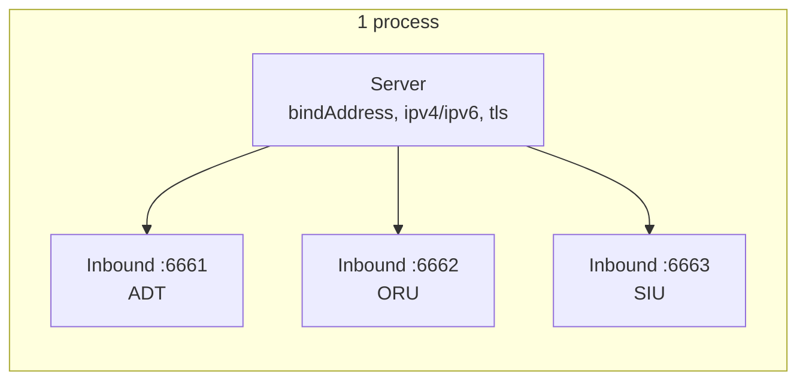

# 🔌 Inbound Listeners

> A single `Server` can host any number of inbound listeners — typically one per HL7 message type / port (ADT on 6661, ORU on 6662, …). Each listener owns its own MSH‑override config and handler.

## 🧾 Table of Contents

1. [Server vs. Inbound](#-server-vs-inbound)
2. [Server options](#-server-options)
3. [Inbound options](#-inbound-options)
4. [The handler](#-the-handler)
5. [Reading the `req`](#-reading-the-req)
6. [Events](#-events)
7. [Closing cleanly](#-closing-cleanly)

---

## 🧱 Server vs. Inbound



`new Server(...)` configures the **process** (bind address, TLS, IPv4/IPv6). `server.createInbound(...)` opens an **individual listening port** with its own handler.

```ts
import { Server } from "node-hl7-server";

const server = new Server({ bindAddress: "0.0.0.0" });

const IB_ADT = server.createInbound({ port: 6661 }, async (req, res) => { /* … */ });
const IB_ORU = server.createInbound({ port: 6662 }, async (req, res) => { /* … */ });
```

---

## ⚙️ Server options

```ts
new Server({
  bindAddress: "0.0.0.0",     // default: 0.0.0.0
  encoding: "utf-8",          // default: utf-8
  ipv4: true,                 // default: true
  ipv6: false,                // default: false (mutually exclusive with ipv4)
  // tls: { /* see TLS docs */ },
});
```

> ⚠️ Setting `ipv4: true` **and** `ipv6: true` throws — pick one address family per process.

---

## 🛎️ Inbound options

```ts
server.createInbound(
  {
    port: 6661,                                  // required, 0 < port < 65353
    name: "IB_EPIC_ADT",                         // optional, for logging
    encoding: "utf-8",
    mshOverrides: {                              // see Responses docs
      "3": "MY_APP",
      "9.3": "ACK",
    },
    // responseClass: MyCustomSendResponse,      // advanced — extend BaseSendResponse
  },
  async (req, res) => { /* … */ },
);
```

| Option | Purpose |
|---|---|
| `port` | TCP port to listen on. Required. |
| `name` | Human‑readable identifier; defaults to a random string. |
| `encoding` | Buffer encoding for inbound bytes. Default `utf-8`. |
| `mshOverrides` | Per‑field MSH overrides for the auto‑ACK. See [Responses](../responses/index.md). |
| `responseClass` | Custom subclass of `BaseSendResponse` if you want full control of ACK behavior. |

---

## 🧠 The handler

```ts
type InboundHandler = (req: InboundRequest, res: SendResponse) => void;
```

The handler runs **once per parsed message** — even if the frame was a BHS batch or FHS file containing many messages.

```ts
server.createInbound({ port: 6661 }, async (req, res) => {
  // 1) Inspect the message.
  const msg = req.getMessage();
  const mrn = msg.get("PID.3").toString();

  // 2) Do whatever the system needs.
  await persistAdmission(mrn, msg);

  // 3) Acknowledge the sender. (See Responses docs for AR / AE / custom.)
  await res.sendResponse("AA");
});
```

> 💡 **Acknowledge first, work later.** Push the parsed message onto a queue (Redis, RabbitMQ) before returning — you'll keep the sender unblocked and avoid back-pressure during bursts.

---

## 📨 Reading the `req`

| Method | Returns | Notes |
|---|---|---|
| `req.getMessage()` | `Message` | The parsed message. Throws `HL7ListenerError` if missing. |
| `req.getType()` | `'message' \| 'batch' \| 'file'` | Whether the original frame was a single MSH, BHS batch, or FHS file. |
| `req.getSocket()` | `net.Socket` | The underlying TCP/TLS socket. Throws if the request was constructed without one. |

```ts
const msg  = req.getMessage();
const type = req.getType();
const sock = req.getSocket();

console.log(`📨 ${msg.get("MSH.10")} (${type}) from ${sock.remoteAddress}:${sock.remotePort}`);
```

The full reading API (`get`, `set`, `addSegment`, repetitions, sub‑components) lives in the [client parser docs](../../client/parser/index.md) — `req.getMessage()` returns the same `Message` class.

---

## 📡 Events

`Inbound` extends `EventEmitter`:

| Event | Payload | Fires when… |
|---|---|---|
| `listen` | _none_ | the TCP/TLS server is bound and accepting connections. |
| `client.connect` | `socket: Socket` | a new client connects. |
| `client.close` | `hadError: boolean` | a client disconnects. |
| `client.error` | `err: Error` | a per‑connection error occurs (closes the socket). |
| `error` | `err: Error` | the underlying TCP/TLS server emits an error. |
| `data.raw` | `string` | a complete MLLP message has been buffered, just before parsing. Useful for debug capture. |
| `data.error` | `err: Error` | a frame couldn't be parsed (malformed HL7, unexpected bytes). |
| `response.sent` | _none_ | an ACK was just written to the socket. |

```ts
IB_ADT.on("listen",        () => console.log("🎧 listening"));
IB_ADT.on("client.connect", (s) => console.log("🤝", s.remoteAddress));
IB_ADT.on("data.raw",       (raw) => console.log("📥", raw.length, "bytes"));
IB_ADT.on("response.sent",  () => console.log("✅ ACK sent"));
IB_ADT.on("data.error",     (err) => console.error("💥 parse error", err));
```

---

## 🚪 Closing cleanly

HL7 servers are typically long‑lived — designed to be up at all times. When you do shut down (deploys, scale-down):

```ts
await IB_ADT.close();   // close one listener
// or close many in parallel:
await Promise.all([IB_ADT.close(), IB_ORU.close()]);
```

`close()` destroys all open client sockets and unrefs the listening server.
