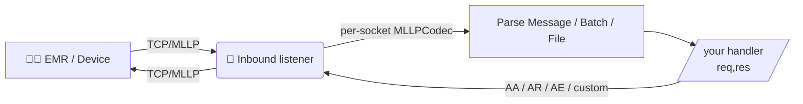
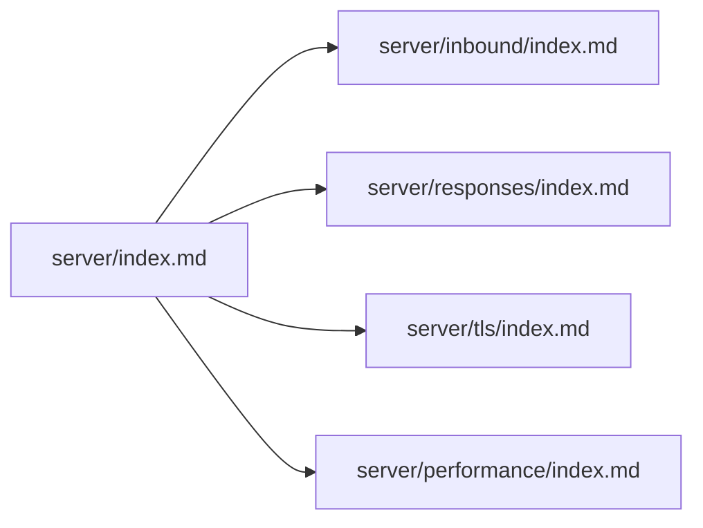

# 🏥 Node HL7 Server :: Documentation

> The Node HL7 Server accepts HL7 v2.x messages over TCP/MLLP, parses them, and lets your handler reply with auto‑generated or fully custom acknowledgements. It pairs with [`node-hl7-client`](../client/index.md) for full coverage.

## ✨ At a glance

Every connection gets its own `MLLPCodec` so concurrent senders never interleave their byte streams. Your handler receives one parsed `Message` at a time even if the inbound frame is a BHS batch or FHS file.

## 🗂️ Documentation layout

| Section | Purpose |
|---|---|
| [🔌 Inbound listeners](inbound/index.md) | Server / Inbound options, request shape, events, multi‑port setups. |
| [📬 Responses](responses/index.md) | Auto ACKs (`sendResponse`), MSH overrides, and **fully custom ACKs** (`sendCustomResponse`). |
| [🔒 TLS & mTLS](tls/index.md) | Server‑auth and mutual‑auth setups, including the snippet hospitals usually want. |
| [⚡ Performance](performance/index.md) | Throughput notes, scaling tips, and what `Inbound.stats` actually measures. |

## 📚 Keyword definitions

The terms **MUST**, **MUST NOT**, **REQUIRED**, **SHALL**, **SHALL NOT**, **SHOULD**, **SHOULD NOT**, **RECOMMENDED**, **MAY**, and **OPTIONAL** follow [RFC 2119](https://www.rfc-editor.org/rfc/rfc2119) semantics.

> ⚠️ **Capitalization matters.** These keywords carry their RFC 2119 meaning **only when written in ALL CAPS**. The lowercase forms (`must`, `should`, `may`, …) are normal English and are not normative.
