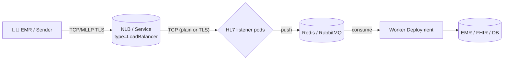
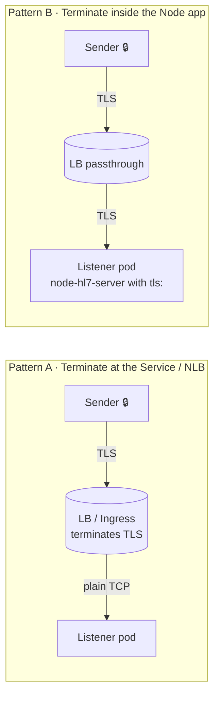

# ☸️ Running `node-hl7-server` on Kubernetes

> A practical reference for scaling the HL7 listener horizontally across multiple pods, decoupling work with Redis or RabbitMQ, and choosing where TLS terminates.



The pattern is always the same:

1. **Listeners** terminate the MLLP frame, parse it, ACK fast, and shove the message onto a queue.
2. **Workers** pull from the queue and do the real work (transform, route to FHIR, write to DB).
3. **Queue** is durable and shared, so any worker pod can pick up any message and pods can come and go without losing data.

## 🧾 Table of Contents

1. [Why split listener and worker?](#-why-split-listener-and-worker)
2. [TLS termination — where?](#-tls-termination--where)
3. [The HL7 listener Deployment + Service](#-the-hl7-listener-deployment--service)
4. [Pattern A — TLS terminated at the Service / NLB](#-pattern-a--tls-terminated-at-the-service--nlb)
5. [Pattern B — TLS terminated at the Node app (mTLS, hospital networks)](#-pattern-b--tls-terminated-at-the-node-app-mtls-hospital-networks)
6. [Wiring up Redis as the durable queue](#-wiring-up-redis-as-the-durable-queue)
7. [Wiring up RabbitMQ as the durable queue](#-wiring-up-rabbitmq-as-the-durable-queue)
8. [Worker deployment](#-worker-deployment)
9. [Health checks, sticky sessions, scaling](#-health-checks-sticky-sessions-scaling)
10. [Sizing & limits](#-sizing--limits)

---

## 🧩 Why split listener and worker?

| Concern | Listener pod | Worker pod |
|---|---|---|
| Goal | ACK fast (sub‑second). | Do the actual work (transform, persist, forward). |
| State | Stateless except for in-flight TCP buffers. | Stateless; idempotent over the queue. |
| Scaling trigger | Inbound connection count / CPU. | Queue depth. |
| Restart cost | Drops in-flight TCP frames (sender retries). | Drops nothing — message stays on the queue. |
| TLS | Yes (or terminated at Service). | No (talks Redis/RabbitMQ over the cluster network). |

Putting heavy work in the listener handler means a downstream FHIR slowdown back-pressures the sender — and an HL7 sender that gets stuck retrying for 30 seconds tends to flood you with duplicates. The "ACK first, queue, work later" pattern is the most important architectural decision in this whole document.

---

## 🔐 TLS termination — where?

Two valid patterns. Pick **one** per environment.



| | **A · Terminate at LB / Service** | **B · Terminate in the Node app** |
|---|---|---|
| Cert lives on | The load balancer (cloud LB, envoy, nginx, etc.) | Each listener pod (mounted secret) |
| mTLS supported | Often, depending on LB | Yes, natively via the `tls` option |
| Easier ops | ✅ One cert renewal point | ❌ Cert distributed to every pod |
| Sees plaintext on the wire inside the cluster | ✅ Yes | ❌ No (encrypted right up to Node) |
| Good fit for | Public-facing, simple TLS | Hospital integrations requiring mTLS / strict cert pinning |

> 🛡️ **mTLS in hospital networks.** Many hospital integration teams insist on **client-cert auth all the way to the application** (no TLS-stripping load balancers in between). That points you at Pattern B even if Pattern A would otherwise be operationally easier.

Both patterns are below.

---

## 🚀 The HL7 listener Deployment + Service

Common to both TLS patterns. We show ADT on port 6661 and ORU on port 6662 — adjust to your traffic shape.

### `Deployment`

```yaml
apiVersion: apps/v1
kind: Deployment
metadata:
  name: hl7-listener
  labels: { app: hl7-listener }
spec:
  replicas: 3
  selector:
    matchLabels: { app: hl7-listener }
  template:
    metadata:
      labels: { app: hl7-listener }
    spec:
      containers:
        - name: hl7-listener
          image: ghcr.io/your-org/hl7-listener:1.0.0
          ports:
            - { name: adt, containerPort: 6661 }
            - { name: oru, containerPort: 6662 }
          env:
            - { name: NODE_ENV, value: "production" }
            - { name: REDIS_URL, valueFrom: { secretKeyRef: { name: hl7-secrets, key: redis-url } } }
            # For Pattern B (mTLS in the Node app), also mount certs.
          readinessProbe:
            tcpSocket: { port: 6661 }
            initialDelaySeconds: 5
            periodSeconds: 10
          livenessProbe:
            tcpSocket: { port: 6661 }
            initialDelaySeconds: 30
            periodSeconds: 30
          resources:
            requests: { cpu: "200m", memory: "256Mi" }
            limits:   { cpu: "1000m", memory: "512Mi" }
```

> ✅ Use **`tcpSocket`** probes, not `httpGet` — the listener doesn't speak HTTP. The MLLP framing makes a real "is the app accepting connections?" probe trivial: if the TCP handshake completes, the pod is healthy.

### `Service`

```yaml
apiVersion: v1
kind: Service
metadata:
  name: hl7-listener
  labels: { app: hl7-listener }
spec:
  type: LoadBalancer            # or ClusterIP behind an Ingress / Gateway API.
  selector: { app: hl7-listener }
  ports:
    - { name: adt, port: 6661, targetPort: adt, protocol: TCP }
    - { name: oru, port: 6662, targetPort: oru, protocol: TCP }
  # 🪝 Sticky sessions: keep one TCP connection on one pod for its lifetime.
  sessionAffinity: ClientIP
  externalTrafficPolicy: Local  # preserves the sender's IP for logging / mTLS CN checks
```

> 🪝 **`sessionAffinity: ClientIP`** matters more than you'd think: HL7 senders typically open one TCP connection per shift and reuse it for thousands of messages. Affinity keeps that connection on a single pod, which means the per-socket `MLLPCodec` buffer state stays consistent.

---

## 🅰️ Pattern A — TLS terminated at the Service / NLB

The simplest setup: the cloud LB (or an ingress controller / service mesh sidecar) handles TLS, and your Node pods speak plain TCP inside the cluster.

```yaml
# AWS NLB example: TLS listener that decrypts and forwards plain TCP.
apiVersion: v1
kind: Service
metadata:
  name: hl7-listener
  annotations:
    service.beta.kubernetes.io/aws-load-balancer-type: "nlb"
    service.beta.kubernetes.io/aws-load-balancer-ssl-cert: "arn:aws:acm:us-east-1:123:certificate/abc"
    service.beta.kubernetes.io/aws-load-balancer-ssl-ports: "6661,6662"
    service.beta.kubernetes.io/aws-load-balancer-backend-protocol: "tcp"
spec:
  type: LoadBalancer
  selector: { app: hl7-listener }
  ports:
    - { name: adt-tls, port: 6661, targetPort: 6661, protocol: TCP }
    - { name: oru-tls, port: 6662, targetPort: 6662, protocol: TCP }
  externalTrafficPolicy: Local
  sessionAffinity: ClientIP
```

The Node app:

```ts
import { Server } from "node-hl7-server";

const server = new Server({ bindAddress: "0.0.0.0" }); // ⬅️ no `tls`
server.createInbound({ port: 6661 }, handleADT);
server.createInbound({ port: 6662 }, handleORU);
```

✅ **Pros**: cert lives in ACM (or cert-manager); rotation is automatic; pods are simpler.
❌ **Cons**: Inside-cluster traffic is plaintext (mitigate with a service mesh if needed); mTLS support depends on the LB.

---

## 🅱️ Pattern B — TLS terminated at the Node app (mTLS, hospital networks)

The LB passes encrypted bytes through to the pod, and `node-hl7-server` itself terminates the TLS handshake — including verifying the client cert.

### Mount the certs as a Kubernetes `Secret`

```bash
kubectl create secret generic hl7-tls \
  --from-file=tls.key=server-key.pem \
  --from-file=tls.crt=server-crt.pem \
  --from-file=ca.crt=trusted-client-ca.pem
```

### Reference the secret in the `Deployment`

```yaml
spec:
  template:
    spec:
      containers:
        - name: hl7-listener
          # ...
          volumeMounts:
            - { name: tls, mountPath: /etc/hl7/tls, readOnly: true }
      volumes:
        - name: tls
          secret:
            secretName: hl7-tls
            defaultMode: 0400
```

### And configure `Server` to use them

```ts
import fs from "node:fs";
import { Server } from "node-hl7-server";

const server = new Server({
  bindAddress: "0.0.0.0",
  tls: {
    key:  fs.readFileSync("/etc/hl7/tls/tls.key"),
    cert: fs.readFileSync("/etc/hl7/tls/tls.crt"),

    // 🤝 mTLS: demand a client cert from every sender.
    requestCert: true,
    rejectUnauthorized: true,
    ca: [fs.readFileSync("/etc/hl7/tls/ca.crt")],
  },
});

server.createInbound({ port: 6661 }, handleADT);
server.createInbound({ port: 6662 }, handleORU);
```

### And the Service / LB needs to **passthrough**

```yaml
apiVersion: v1
kind: Service
metadata:
  name: hl7-listener
  annotations:
    # AWS NLB: no ssl-cert annotation -> raw TCP passthrough.
    service.beta.kubernetes.io/aws-load-balancer-type: "nlb"
    service.beta.kubernetes.io/aws-load-balancer-backend-protocol: "tcp"
spec:
  type: LoadBalancer
  selector: { app: hl7-listener }
  ports:
    - { name: adt, port: 6661, targetPort: 6661, protocol: TCP }
    - { name: oru, port: 6662, targetPort: 6662, protocol: TCP }
  externalTrafficPolicy: Local
  sessionAffinity: ClientIP
```

✅ **Pros**: end-to-end TLS / mTLS; you can read peer certificate details inside the handler via `req.getSocket()`; no third-party LB sees plaintext.
❌ **Cons**: cert rotation across pods (use [`cert-manager`](https://cert-manager.io/) + a rolling restart, or [Reloader](https://github.com/stakater/Reloader) to auto-restart on Secret change).

---

## 🟥 Wiring up Redis as the durable queue

Run Redis as a separate workload (Bitnami / managed Redis / Elasticache, etc.). The listener handler **acknowledges first**, then publishes:

```ts
import { createClient } from "@redis/client";
import { Server } from "node-hl7-server";

const redis = createClient({ url: process.env.REDIS_URL });
await redis.connect();

const server = new Server({ bindAddress: "0.0.0.0" });

server.createInbound({ port: 6661, name: "IB_ADT" }, async (req, res) => {
  const msg = req.getMessage();

  // 1️⃣  Push the parsed message onto the queue. Sub-millisecond.
  await redis.lPush("hl7:adt", JSON.stringify({
    receivedAt: new Date().toISOString(),
    sourceIp:   req.getSocket().remoteAddress,
    controlId:  msg.get("MSH.10").toString(),
    raw:        msg.toString(),
  }));

  // 2️⃣  ACK the sender. They unblock immediately.
  await res.sendResponse("AA");
});
```

> 💡 **Use a separate list per workflow** (`hl7:adt`, `hl7:oru`, `hl7:siu`) so workers can scale independently.

A minimal Redis deployment for dev/staging:

```yaml
apiVersion: apps/v1
kind: StatefulSet
metadata: { name: redis }
spec:
  serviceName: redis
  replicas: 1
  selector: { matchLabels: { app: redis } }
  template:
    metadata: { labels: { app: redis } }
    spec:
      containers:
        - name: redis
          image: redis:7-alpine
          args: ["--appendonly", "yes"]   # 🪛 enable AOF for durability
          ports: [{ containerPort: 6379 }]
          volumeMounts: [{ name: data, mountPath: /data }]
  volumeClaimTemplates:
    - metadata: { name: data }
      spec: { accessModes: [ReadWriteOnce], resources: { requests: { storage: 5Gi } } }
---
apiVersion: v1
kind: Service
metadata: { name: redis }
spec:
  selector: { app: redis }
  ports: [{ port: 6379, targetPort: 6379 }]
```

> 🚨 **Production**: use a managed Redis (Elasticache, Memorystore, Upstash) or run Sentinel/Cluster. A single-pod Redis can lose un-flushed messages on a node failure.

---

## 🟧 Wiring up RabbitMQ as the durable queue

When you need topic routing (one HL7 message → multiple consumers) or persistent durable queues with confirms, RabbitMQ is the better fit:

```ts
import amqp from "amqplib";
import { Server } from "node-hl7-server";

const conn = await amqp.connect(process.env.RABBITMQ_URL!);
const ch   = await conn.createConfirmChannel();
await ch.assertQueue("hl7.adt", { durable: true });

const server = new Server({ bindAddress: "0.0.0.0" });

server.createInbound({ port: 6661 }, async (req, res) => {
  const msg = req.getMessage();
  const buf = Buffer.from(msg.toString(), "utf-8");

  // Publish with a confirm so we know the broker has it before we ACK.
  await new Promise<void>((resolve, reject) => {
    ch.sendToQueue("hl7.adt", buf, { persistent: true }, (err) =>
      err ? reject(err) : resolve(),
    );
  });

  await res.sendResponse("AA");
});
```

> ⚠️ Wait for the **confirm** before sending the ACK — otherwise you can ACK a sender, lose the broker connection, and silently drop the message.

---

## 🟦 Worker deployment

Workers are completely separate from the listener — they don't bind any TCP ports, just consume the queue:

```yaml
apiVersion: apps/v1
kind: Deployment
metadata: { name: hl7-worker }
spec:
  replicas: 2
  selector: { matchLabels: { app: hl7-worker } }
  template:
    metadata: { labels: { app: hl7-worker } }
    spec:
      containers:
        - name: worker
          image: ghcr.io/your-org/hl7-worker:1.0.0
          env:
            - { name: REDIS_URL, valueFrom: { secretKeyRef: { name: hl7-secrets, key: redis-url } } }
          resources:
            requests: { cpu: "200m", memory: "256Mi" }
            limits:   { cpu: "1000m", memory: "1Gi" }
```

…and a minimal Redis worker:

```ts
import { createClient } from "@redis/client";
import { Message } from "node-hl7-client";

const redis = createClient({ url: process.env.REDIS_URL });
await redis.connect();

while (true) {
  // BLPOP blocks until a message is available — no busy-loop.
  const popped = await redis.blPop("hl7:adt", 5);
  if (!popped) continue;

  const env = JSON.parse(popped.element);
  const msg = new Message({ text: env.raw });

  await persistAdmission(msg, env);              // 🩺 the actual work
  await forwardToFhir(msg);                      // 🌐 downstream system
}
```

Scale workers based on **queue depth** (e.g. with KEDA) rather than CPU — if FHIR slows down, you want more workers, not more listener pods.

---

## ❤️ Health checks, sticky sessions, scaling

| Concern | Recipe |
|---|---|
| Probes | `tcpSocket` on the HL7 port. The MLLP listener doesn't speak HTTP. |
| Sticky sessions | `sessionAffinity: ClientIP` on the `Service`. Keeps a sender's connection on one pod (and so its MLLPCodec buffer) for the connection's lifetime. |
| Pod restarts | Use `terminationGracePeriodSeconds: 60` and a `preStop` that calls your shutdown hook (`await IB.close()`) so in-flight ACKs finish before the pod dies. |
| HPA on the listener | Scale on **`net_connection_count`** if you can; CPU is a poor proxy for "I'm overloaded with senders". |
| HPA on the worker | Scale on **queue depth** (KEDA Redis or RabbitMQ scaler). |
| TLS rotation (Pattern B) | `cert-manager` + [Reloader](https://github.com/stakater/Reloader) to roll pods on Secret change. |

---

## 📏 Sizing & limits

For the typical hospital workload (~60K ADT/day with bursts to a few hundred per minute) a starter shape is:

| Workload | Replicas | CPU | Memory |
|---|---|---|---|
| `hl7-listener` | 2–3 | 200m / 1 CPU | 256Mi / 512Mi |
| `hl7-worker` | 2–4 | 200m / 1 CPU | 256Mi / 1 GiB |
| Redis (single, AOF) | 1 (managed/HA in prod) | 100m / 500m | 256Mi / 1 GiB |

If you exceed those numbers comfortably, the bottleneck is almost always downstream (FHIR / DB) rather than the HL7 listener — `node-hl7-server` itself moves messages at hundreds-per-second on a single pod. See [`pages/server/performance/index.md`](../performance/index.md) for the full throughput notes.

---

## 🔗 See also

- [Performance & throughput notes](../performance/index.md) — what `node-hl7-server` measures and how to read `Inbound.stats`.
- [TLS & mTLS](../tls/index.md) — the underlying Node-side TLS / mTLS configuration that Pattern B uses.
- [Custom queues on the client side](../../client/client/index.md#-custom-behavior-using-redis) — the symmetric pattern when **sending** HL7 from a Kubernetes pod.
