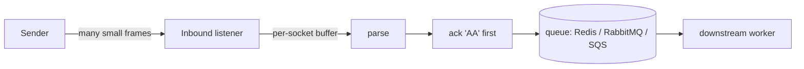

# ⚡ Performance & Throughput

> A practical guide to running `node-hl7-server` at hospital scale — what the library does for you, what you should do for it, and how to measure.



The golden rule: **acknowledge first, work later.**

---

## 📈 What "high throughput" usually looks like

| Workload | Sustained rate | Burst rate |
|---|---|---|
| ~60,000 ADT/day | ~0.7 msg/s | a few hundred/min |
| ORU result feed | varies | spiky around shift handoffs |
| Discharge/admission audits | low/sustained | end-of-day spikes |

For these patterns `node-hl7-server` runs comfortably on a single Node process. The unit tests include a 200‑message burst that completes in well under a second on commodity hardware with zero drops.

---

## 🧩 What the library guarantees

- 🧵 **Per-socket MLLP framing.** Each TCP connection has its own `MLLPCodec`. Concurrent senders don't interleave each other's bytes, and large messages can arrive across many TCP packets without corruption.
- 🤝 **Connection isolation.** A misbehaving client can't poison the parser state of other clients on the same listener.
- 📊 **Stats counters.** `inbound.stats.received` (frames seen) and `inbound.stats.totalMessage` (parsed messages — incremented per inner message inside batches/files).

```ts
setInterval(() => {
  console.log("📊", IB_ADT.stats);
  // { received: 38221, totalMessage: 38275 }
}, 30_000);
```

---

## 🛠️ What you should do

### 1. Acknowledge first, work later

Don't do heavy work in the handler. Pop the `Message` onto a queue and let a worker process it.

```ts
server.createInbound({ port: 6661, version: "2.7" }, async (req, res) => {
  await queue.publish(req.getMessage().toString()); // milliseconds
  await res.sendResponse("AA");                     // sender unblocked
});
```

This minimizes back-pressure on the sender and keeps your event loop free.

### 2. One port per workflow

It's idiomatic for HL7 environments to dedicate a port per message type:

```ts
server.createInbound({ port: 6661, version: "2.7", name: "IB_ADT" }, handleADT);
server.createInbound({ port: 6662, version: "2.7", name: "IB_ORU" }, handleORU);
server.createInbound({ port: 6663, version: "2.7", name: "IB_SIU" }, handleSIU);
```

Each listener has its own handler, MSH overrides, and stats. Routing is implicit by port.

### 3. Externalize the queue

Don't rely on the in-memory queue inside Kubernetes — pod restarts will drop messages. Use Redis (preferred), RabbitMQ, SQS, or a database.

> 🔐 **Tag messages per listener** if multiple listeners share a queue, so workers don't dequeue the wrong type.

### 4. TLS termination at the edge (when CPU-bound)

If TLS handshakes are the bottleneck (rare, but possible at very high concurrency), terminate at a sidecar (envoy, nginx, AWS NLB+ACM) and run `node-hl7-server` in plain TCP locally inside the cluster.

### 5. Watch `data.error`

Log `inbound.on("data.error", ...)`. In healthy production you'll see effectively zero of these; a sudden spike usually means a sender is producing malformed MLLP frames or there's a TCP path corruption issue.

---

## 🧪 Benchmarks you can run yourself

The repo's [`__tests__/server/hl7.issues.test.ts`](https://github.com/Bugs5382/node-hl7/blob/main/packages/node-hl7-server/__tests__/server/hl7.issues.test.ts) includes:

- **Concurrent connections test** — two simultaneous senders pushing interleaved messages over the same listener (verifies the per-socket codec).
- **TCP fragmentation test** — an 8 KB MLLP frame written in 64-byte chunks (simulates an Epic ADT^A08 over a slow link).
- **200-message burst** — a single connection sending 200 messages back-to-back; asserts no drops and a 10 s ceiling.

Use these as starting points for your own load tests:

```bash
npx vitest run __tests__/server/hl7.issues.test.ts
```

---

## 🧭 Scaling beyond one process

`node-hl7-server` is a single-process Node application — you scale it horizontally with multiple pods/instances behind a TCP load balancer. Two notes:

1. **MLLP is connection-oriented**, so the load balancer should distribute *connections*, not packets. Most TCP LBs do this by default.
2. **Sticky sessions are good**. A sender often holds a single TCP connection for the whole shift; routing it to the same backend reduces handshake cost. AWS NLB and HAProxy both support this.

For Kubernetes deployments, see the dedicated [☸️ Kubernetes deployment guide](../kubernetes/index.md) — it covers horizontal listener pods, Redis / RabbitMQ workers, sticky sessions, sizing, and the TLS-termination tradeoff (LB vs. in-app). The [client-side k8s notes](../../client/client/index.md#-scalability--message-reliability-in-kubernetes) cover the symmetric pattern when *sending* HL7 from a pod.
