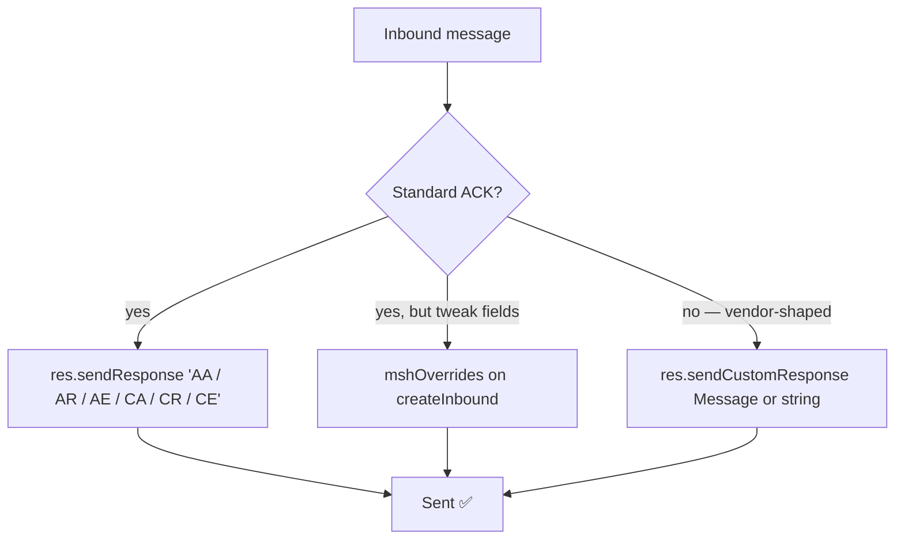

# 📬 Responses (ACKs)

> Three ways to reply: standard ACK with `sendResponse`, MSH overrides on the auto‑generated ACK, or fully verbatim with `sendCustomResponse`.



---

## 🧾 Table of Contents

1. [Standard ACK (`sendResponse`)](#-standard-ack-sendresponse)
2. [MSH field overrides](#-msh-field-overrides)
3. [Custom ACK (`sendCustomResponse`)](#-custom-ack-sendcustomresponse)
4. [`getAckMessage()` after sending](#-getackmessage-after-sending)
5. [Custom subclass via `responseClass`](#-custom-subclass-via-responseclass)

---

## 🤝 Standard ACK (`sendResponse`)

```ts
await res.sendResponse("AA"); // Application Accept
await res.sendResponse("AR"); // Application Reject
await res.sendResponse("AE"); // Application Error
await res.sendResponse("CA"); // Commit Accept   (HL7 ≥ 2.2)
await res.sendResponse("CR"); // Commit Reject   (HL7 ≥ 2.2)
await res.sendResponse("CE"); // Commit Error    (HL7 ≥ 2.2)
```

The library auto-generates a syntactically correct ACK by:

- Swapping `MSH.5` ↔ `MSH.3` and `MSH.6` ↔ `MSH.4` (sender/receiver flipped).
- Setting `MSH.7` to "now".
- Using `ACK^<EventCode>` for `MSH.9` (or just `ACK` on 2.1).
- Echoing the original `MSH.10` into `MSA.2`.
- Reusing the inbound `MSH.11` and `MSH.12`.

Resulting ACK example for an inbound `ADT^A01` with control id `MSG00001` on 2.5:

```text
MSH|^~\&|RECV|RFAC|EPIC|HOSP|20240101000005||ACK^A01|97f23ad1|P|2.5
MSA|AA|MSG00001
```

> ⚠️ **Version gate.** `CA` / `CR` / `CE` are valid only on HL7 ≥ 2.2. If the inbound message is `2.1`, the library refuses and emits an `AE` instead. `AA` / `AR` / `AE` are universal.

---

## 🧩 MSH field overrides

When the auto-ACK is *almost* right but a few MSH fields need tweaking, set `mshOverrides` on the listener. Each entry is a literal value or a callback that receives the inbound `Message`:

```ts
import { format } from "date-fns";

server.createInbound(
  {
    port: 3000,
    mshOverrides: {
      "3": "MY_APP",                                       // literal
      "7": () => format(new Date(), "yyyyMMddHHmmssxx"),   // calculated timestamp
      "9.3": "ACK",                                        // composite trigger
      "12": (msg) => msg.get("MSH.12").toString(),         // copy from inbound
      "18": "UNICODE UTF-8",                               // charset
    },
  },
  async (req, res) => {
    await res.sendResponse("AA");
  },
);
```

> ❗ Overrides apply only to `sendResponse(...)`. They are intentionally skipped by `sendCustomResponse(...)` — the whole point of a custom ACK is that *you* control every byte.

---

## 🎯 Custom ACK (`sendCustomResponse`)

Some receivers expect vendor-shaped ACKs:

- additional `MSA` fields (`MSA.3`, `MSA.6`),
- explicit `ERR` segments,
- alternate `MSH.3` / `MSH.4` even when the message direction would normally swap,
- custom Z-segments.

`sendCustomResponse` writes the message you provide **verbatim** through the MLLP codec. No validation, no field swapping, no overrides.

```ts
import { Message, createHL7Date } from "node-hl7-client";

server.createInbound({ port: 3000 }, async (req, res) => {
  const original = req.getMessage();
  const ctrlId = original.get("MSH.10").toString();

  const ack = new Message({
    text: [
      `MSH|^~\\&|MY_APP|MY_FAC|EPIC|HOSP|${createHL7Date(new Date())}||ACK^A01|RESP_${ctrlId}|P|2.5`,
      `MSA|AA|${ctrlId}|All good|||MY_VENDOR_OK`,
      `ERR|||0^Message accepted^HL70357|I`,
    ].join("\r"),
  });

  await res.sendCustomResponse(ack);     // Message instance
});
```

The string variant is also supported:

```ts
await res.sendCustomResponse(`MSH|^~\\&|...\rMSA|AA|...`);
```

You can also customize the encoding (defaults to `utf-8`):

```ts
await res.sendCustomResponse(ack, "latin1");
```

> 💡 **When to use which?** Reach for `sendResponse` first — it's compact and follows the spec. Use `mshOverrides` when one or two MSH fields must look a particular way. Reach for `sendCustomResponse` when the receiver expects a layout the auto-generator can't produce (extra segments, vendor MSA suffixes, etc.).

---

## 🪞 `getAckMessage()` after sending

After either `sendResponse` or `sendCustomResponse`, the ACK is stored on the response object and accessible via:

```ts
const ack = res.getAckMessage();
console.log(ack?.get("MSA.1").toString());  // "AA"
console.log(ack?.get("MSH.10").toString()); // ACK control id
```

This is handy for logging / observability — you can record the exact bytes you replied with without re-deriving them.

---

## 🛠️ Custom subclass via `responseClass`

If you need to override deeply (custom encoding logic, alternate framing, instrumentation hooks), extend `BaseSendResponse` and pass the class on `createInbound`:

```ts
import { BaseSendResponse } from "node-hl7-server";

class LoggedResponse extends BaseSendResponse {
  async sendResponse(type, encoding = "utf-8") {
    // delegate to the standard impl by composing, or write your own.
    const ack = /* construct an HL7 Message */;
    this._ack = ack;
    this._codec.sendMessage(this._socket, ack.toString(), encoding);
    this.emit("response.sent");
    auditLog.info({ ackId: ack.get("MSH.10").toString(), type });
  }
}

server.createInbound({ port: 3000, responseClass: LoggedResponse }, handler);
```

> 🚨 If you override `sendResponse`, you also inherit `sendCustomResponse` from `BaseSendResponse` for free — no need to re-implement it unless you want to.
