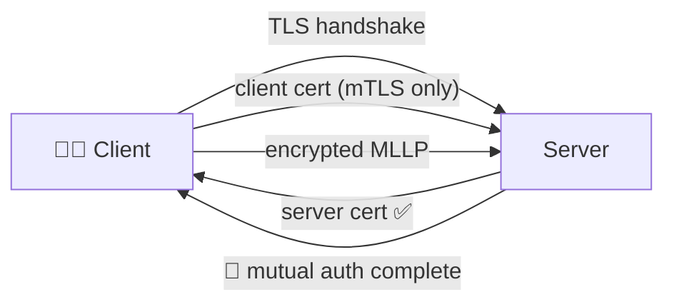

# 🔒 TLS & 🛡️ Mutual TLS (mTLS)

> Hospitals frequently require encrypted transport — and increasingly require **client certificate authentication** (mTLS) too. `node-hl7-server` supports both with the same `tls` option.



## 🧾 Table of Contents

1. [Server-auth TLS](#-server-auth-tls)
2. [Mutual TLS](#-mutual-tls)
3. [Inspecting the peer certificate](#-inspecting-the-peer-certificate)
4. [Certificate generation cheat sheet](#-certificate-generation-cheat-sheet)
5. [Common pitfalls](#-common-pitfalls)

---

## 🔐 Server-auth TLS

The client validates *your* certificate; you don't ask for theirs.

```ts
import fs from "node:fs";
import path from "node:path";
import { Server } from "node-hl7-server";

const server = new Server({
  tls: {
    key: fs.readFileSync(path.join("certs", "server-key.pem")),
    cert: fs.readFileSync(path.join("certs", "server-crt.pem")),
    rejectUnauthorized: false,                        // dev only
  },
});

server.createInbound({ port: 6661 }, async (req, res) => {
  await res.sendResponse("AA");
});
```

The underlying socket flips from `net.Socket` to `tls.TLSSocket`. `req.getSocket()` returns the TLS variant so you can read peer details.

---

## 🛡️ Mutual TLS

Tell the server to **demand** a client certificate, validate it against a list of trusted CAs, and reject anyone else.

```ts
import fs from "node:fs";
import path from "node:path";
import { Server } from "node-hl7-server";

const server = new Server({
  tls: {
    // 🔑 Server identity
    key: fs.readFileSync(path.join("certs", "server-key.pem")),
    cert: fs.readFileSync(path.join("certs", "server-crt.pem")),

    // 🤝 Demand a client certificate.
    requestCert: true,
    // 🚫 Drop the connection if the client cert isn't signed by one of `ca`.
    rejectUnauthorized: true,
    ca: [
      fs.readFileSync(path.join("certs", "trusted-client-ca.pem")),
      // Add as many trusted issuers as you need.
    ],
  },
});

server.createInbound({ port: 6661 }, async (req, res) => {
  await res.sendResponse("AA");
});
```

| Option | Effect |
|---|---|
| `requestCert: true` | Server asks for a client cert during the handshake. |
| `rejectUnauthorized: true` | Drop the connection if the client cert isn't signed by an entry in `ca`. |
| `ca: Buffer[]` | The set of trusted client-CA certificates. Multiple CAs are fine. |

> 🚨 **Production**: never set `rejectUnauthorized: false` for mTLS — that's "request a cert and accept anything". Use it only for local development.

---

## 👤 Inspecting the peer certificate

Once the handshake completes, the peer certificate is available via the TLS socket:

```ts
import type { TLSSocket } from "node:tls";

server.createInbound({ port: 6661 }, async (req, res) => {
  const sock = req.getSocket() as TLSSocket;

  if (typeof sock.getPeerCertificate === "function") {
    const peer = sock.getPeerCertificate();
    console.log("🤝 mTLS peer:", peer.subject?.CN, "issued by", peer.issuer?.CN);

    // Reject programmatically (in addition to rejectUnauthorized) if you
    // need fine-grained checks like CN allow-listing:
    if (peer.subject?.CN !== "expected-client-cn") {
      res.getSocket().destroy();
      return;
    }
  }

  await res.sendResponse("AA");
});
```

`tls.TLSSocket#getPeerCertificate()` returns `{}` if the peer didn't present a cert — combined with `rejectUnauthorized: true` you'll never see that case in practice, but a defensive check is cheap.

---

## 🧾 Certificate generation cheat sheet

For local testing, OpenSSL is the easiest tool. The commands below produce a self-signed CA, a server cert signed by that CA, and a client cert signed by the same CA. The repo's `certs/` folder follows this layout.

```bash
# 1) CA
openssl genrsa -out server-ca-key.pem 4096
openssl req -x509 -new -key server-ca-key.pem -days 3650 -out server-ca-crt.pem \
  -subj "/CN=node-hl7 dev CA"

# 2) Server cert
openssl genrsa -out server-key.pem 4096
openssl req -new -key server-key.pem -out server-csr.pem \
  -subj "/CN=hl7.example.local"
openssl x509 -req -in server-csr.pem \
  -CA server-ca-crt.pem -CAkey server-ca-key.pem -CAcreateserial \
  -out server-crt.pem -days 825 -sha256

# 3) Client cert (used by the connecting client; the server validates against the same CA)
openssl genrsa -out client-key.pem 4096
openssl req -new -key client-key.pem -out client-csr.pem \
  -subj "/CN=client-app-1"
openssl x509 -req -in client-csr.pem \
  -CA server-ca-crt.pem -CAkey server-ca-key.pem -CAcreateserial \
  -out client-crt.pem -days 825 -sha256
```

In production these come from your hospital PKI / a real CA — never commit private keys.

---

## ⚠️ Common pitfalls

| Symptom | Likely cause |
|---|---|
| `TLS handshake aborted` | `requestCert: true` but client didn't present one. |
| `unable to verify the first certificate` | Client/server cert chain isn't fully presented; concatenate intermediates into `cert`. |
| Connections closed immediately | Wrong CA in `ca`, or client's CA isn't in the bundle you provided. |
| Works locally, fails in prod | `rejectUnauthorized: false` masking a real cert problem in dev. |
| `getPeerCertificate()` returns `{}` | `requestCert: true` was missing — you can't read what you never asked for. |

> 💡 Capture the raw frame on `data.raw` and the parse error on `data.error` while debugging — they often reveal a TLS misconfiguration before the HL7 layer even sees a frame.
